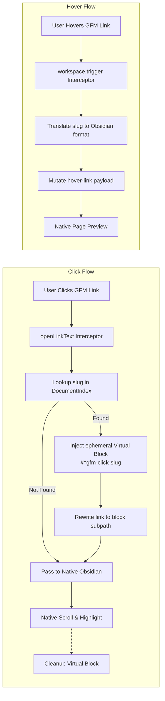

# GFM Heading Links

Resolve GFM-style kebab-case heading links at runtime inside Obsidian — no export hacks, no file modification.

## What it does

By default, Obsidian doesn't understand GFM (GitHub Flavored Markdown) heading slugs like `#red-hat-based-distributions-centos-fedora`. This plugin resolves them at runtime so that both clicks and Ctrl+hover previews navigate to the correct heading.

**Example:** A link `[test](#red-hat-based-distributions-centos-fedora)` will resolve to the heading `## Red Hat-Based Distributions (CentOS, Fedora)`.

## How it works

Instead of relying on fragile DOM mutation observers or CodeMirror 6 `ViewPlugin` extensions that aggressively swallow `mouseover` events (which breaks native behaviors like Ctrl+Hover), this plugin intercepts links at the **core routing layer** of Obsidian.

- **Click Navigation (`openLinkText`)**: The plugin monkeypatches `app.workspace.openLinkText`. Any time a link is clicked anywhere in the app (Live Preview, Source Mode, or Reading View), we intercept the link payload and look up the slug in our lightweight background `DocumentIndex`. We then temporarily inject a virtual block (`#^gfm-click-<slug>`) into Obsidian's cache. This forces Obsidian's native routing to smoothly scroll and highlight the correct heading—even for duplicate slugs!
- **Page Preview (`hover-link`)**: The plugin monkeypatches `app.workspace.trigger`. When the native Markdown view detects a hover and fires the `"hover-link"` event, we mutate the event's `linktext` property mid-air before it reaches the Page Preview plugin.
- **Autocomplete (`EditorSuggest.selectSuggestion`)**: When you type `[[#` and select a heading from the dropdown, the inserted link automatically uses the GFM slug format (`[My Heading](file.md#my-heading)`) instead of Obsidian's native format. The original heading text is preserved as the alias.



Because the routing layer is patched, **100% of native behavior is preserved**:

- `Ctrl + Hover` works perfectly without manual coordinate positioning.
- Cross-file links (`[Link](file-2.md#slug)`) resolve seamlessly.
- Other plugins relying on standard workspace link navigation remain unaffected.

## Architectural References

To achieve this, the plugin leverages undocumented patterns from the Obsidian architecture, derived from community plugin documentation:

- [Workspace.openLinkText](https://docs.obsidian.md/Reference/TypeScript+API/Workspace/openLinkText): The primary mechanism for programmatic navigation in Obsidian.
- **The `"hover-link"` payload**: Discovered via internal community guides (e.g., [Build a Bases view](https://docs.obsidian.md/Plugins/Guides/Build+a+Bases+view)), the `workspace.trigger('hover-link', ...)` event expects an object containing `{ event, source, hoverParent, targetEl, linktext }`. Mutating `linktext` inside this payload allows us to trick the Page Preview plugin into finding the correct heading.

## Compatibility

- Requires Obsidian ≥ 0.14.8
- Works on desktop and mobile (no Node/Electron APIs)
- Compatible with Better Markdown Links

## Development

```bash
npm install
npm run dev     # watch mode for development
npm run build   # production build (tsc + esbuild)
npm test        # run 17 unit tests (vitest)
```

## Known Limitations

- **HTML anchor links** (`<a id="...">`) only resolve on click in Reading mode. Live Preview and Source mode support is under investigation.
- **HTML anchor hover preview** is not yet supported.
- **GFM collision suffix ambiguity**: when a heading's literal text matches another heading's collision suffix (e.g., `## Commands-1` coexisting with duplicate `## Commands`), the last heading in document order wins. A first-occurrence priority fix is planned for v2.

## License

MIT
