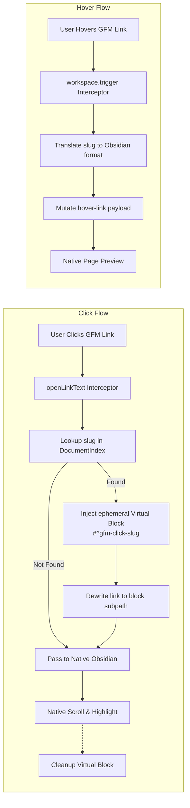

# GFM Heading Links

[](https://github.com/lucasgaldinos/obsidian-gfm-headers/releases)
[](LICENSE)
[](https://obsidian.md)

Resolve GFM-style kebab-case heading links at runtime inside Obsidian — no export hacks, no file modification.

## What it does

Obsidian uses its **own** heading slug format (case-sensitive, spaces preserved): a heading `## My Heading: Part 1` produces `#My Heading: Part 1`. GitHub Flavored Markdown (GFM) uses a different standard: the same heading becomes `#my-heading-part-1`.

This plugin bridges that gap. Links written in GFM format resolve correctly at runtime:

| Without plugin | With plugin |
| --- | --- |
| `[test](#red-hat-based-distributions-centos-fedora)` → ❌ dead link | → ✅ navigates to `## Red Hat-Based Distributions (CentOS, Fedora)` |
| `[[Note#my-heading]]` → ❌ unresolved | → ✅ resolves to the correct heading in `Note.md` |
| Autocomplete inserts `#My Heading` | → inserts `#my-heading` with `\|My Heading` alias |

Both **clicks** and **Ctrl+hover previews** work. Cross-file links resolve seamlessly. The autocomplete dropdown automatically produces GFM slugs when you type `[[#`.

## How it works

Instead of DOM mutation observers or CodeMirror 6 `ViewPlugin` extensions (which break native behaviors like Ctrl+Hover), this plugin intercepts links at Obsidian's **core routing layer**:

- **Click Navigation (`openLinkText`)**: Monkeypatches `app.workspace.openLinkText`. When any link is clicked (Live Preview, Source Mode, or Reading View), the slug is looked up in a lightweight `DocumentIndex`. A temporary virtual block (`#^gfm-click-<slug>`) is injected into Obsidian's metadata cache, triggering native scroll + highlight — even for duplicate headings.
- **Page Preview (`hover-link`)**: Monkeypatches `app.workspace.trigger`. When Obsidian fires the `"hover-link"` event, the `linktext` property is mutated mid-air before the Page Preview plugin processes it.
- **Autocomplete (`EditorSuggest.selectSuggestion`)**: When you select a heading from the `[[#` dropdown, the inserted link uses the GFM slug format. The original heading text is preserved as the display alias (e.g., `[[#my-heading\|My Heading]]`).



Because the routing layer is patched, **100% of native behavior is preserved**:

- `Ctrl + Hover` works perfectly without manual coordinate positioning.
- Cross-file links (`[Link](file-2.md#slug)`) resolve seamlessly.
- Other plugins relying on standard workspace link navigation remain unaffected.

## Settings

The plugin adds a settings tab under **Settings → GFM Heading Links**:

| Setting | Default | Description |
| --- | --- | --- |
| **Link prefix** | `""` (empty) | Character prepended to the GFM slug in autocomplete output. Example: `§` → `[[Note#§my-heading]]`. |
| **Link suffix** | `""` (empty) | Character appended to the GFM slug in autocomplete output. Example: `¶` → `[[Note#my-heading¶]]`. |
| **Enable wikilink alias** | `true` | When using wikilinks (`[[`), automatically appends `\|Original Heading` after the GFM slug. Disable for bare `[[#slug]]`. |

Affixes are **cosmetic only** — they are stripped during link resolution so navigation still works regardless of what prefix/suffix you configure.

## Compatibility

- Requires **Obsidian ≥ 1.0.0**
- Works on **desktop and mobile** (no Node.js or Electron APIs)
- Compatible with Better Markdown Links

## Documentation

- **[Architecture](docs/architecture.md)** — System class diagram, interaction flowcharts, lifecycle sequences, virtual block injection pattern, and design decisions.
- **[GFM Spec & Comparisons](docs/research/gfm-spec-and-comparisons.md)** — How GitHub's heading slug algorithm differs from Obsidian's, with test cases.
- **[Architectural History](docs/research/architectural-history.md)** — Why the plugin abandoned CM6 ViewPlugins and DOM MutationObservers in favor of workspace-level monkeypatching.
- **[Changelog](CHANGELOG.md)** — Release history and notable changes.

## Development

```bash
npm install       # install dependencies
npm run dev       # watch mode for development (DEBUG_ENABLED=true)
npm run build     # production build: tsc type-check + esbuild bundle
npm test          # run unit tests (vitest)
npm run lint      # run ESLint with eslint-plugin-obsidianmd
```

### Pre-submission validation

Before submitting to the [Obsidian Community Directory](https://community.obsidian.md), run `npm run lint` to catch issues that would fail the automated source code review:

- **Semver validation** — `minAppVersion` must use three-segment semver (`x.y.z`, not `x.y`).
- **Sentence case** — UI text must follow [Obsidian's style guide](https://help.obsidian.md/Contributing+to+Obsidian/Style+guide).
- **API compatibility** — only APIs available in declared `minAppVersion` are allowed.

Powered by [eslint-plugin-obsidianmd](https://www.npmjs.com/package/eslint-plugin-obsidianmd).

### Branches

- `main` — production (`DEBUG_ENABLED=false`). Tag releases here.
- `dev` — development (`DEBUG_ENABLED=true`). Feature branches from here.

## Known Limitations

- **HTML anchor hover preview**: `<a id="...">` and `<a name="...">` targets resolve correctly on **click** (all view modes — the async resolver reads file content via `vault.read()`), but hover preview does not yet support HTML anchors. The hover interceptor uses the synchronous `resolveGfmTargetSync()` path which only consults the in-memory metadata cache (no disk I/O for HTML anchor scanning).

## License

[License](./LICENSE)

## Author

[Lucas Galdino](https://github.com/lucasgaldinos)
