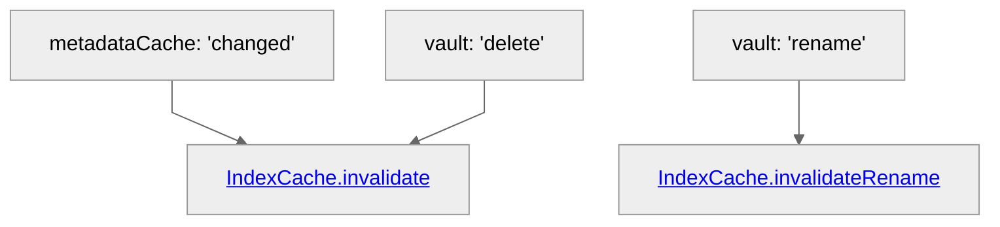
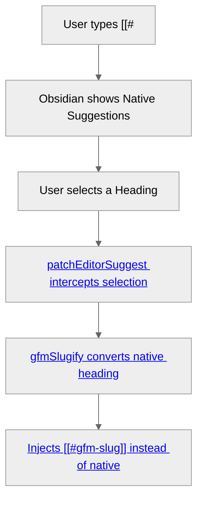
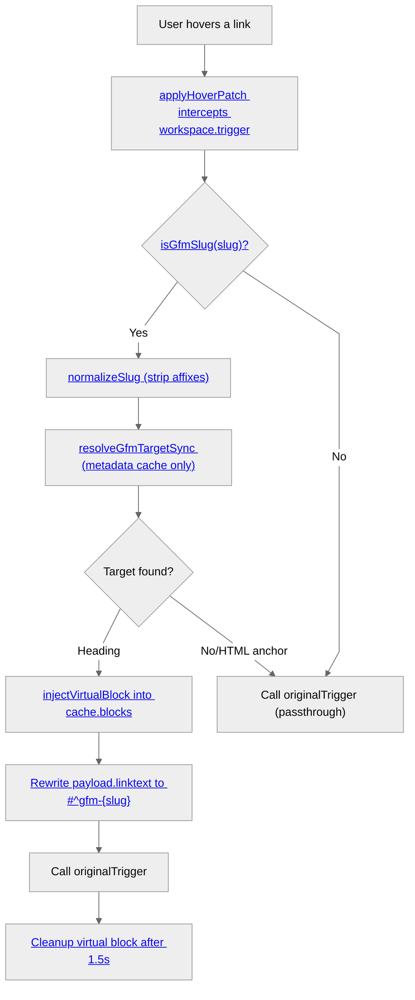
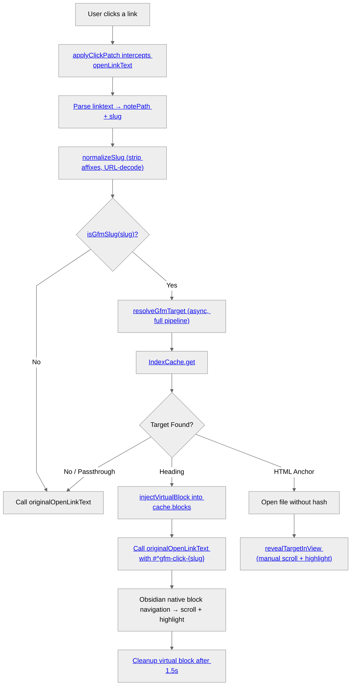
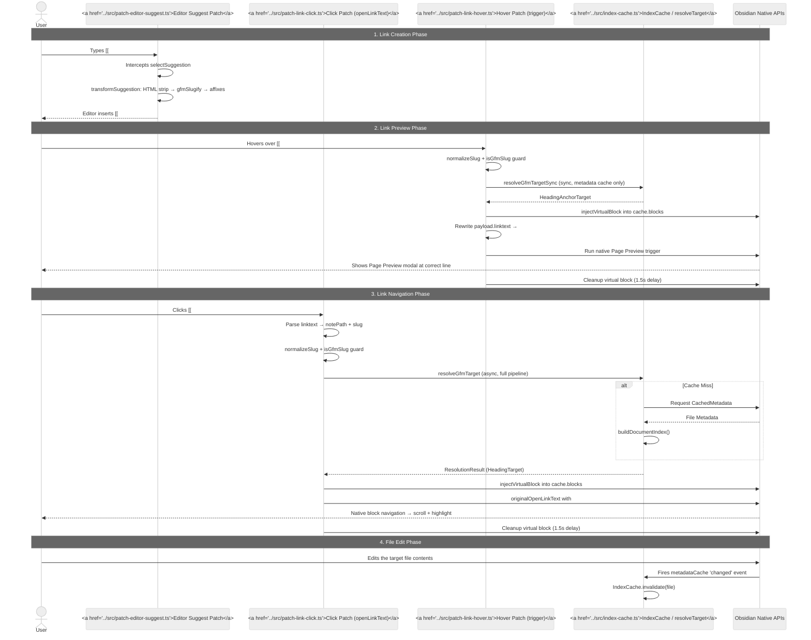

# GFM Heading Links Architecture (Complete System)

These updated diagrams map out **all** interactions across the plugin's lifecycle, including editor auto-completion, page preview hovers, cache invalidations, and link clicks.

- [GFM Heading Links Architecture (Complete System)](#gfm-heading-links-architecture-complete-system)
  + [1. System Class \& Module Diagram](#1-system-class--module-diagram)
    - [1.1 Module Responsibilities](#11-module-responsibilities)
  + [2. Interaction Flowcharts](#2-interaction-flowcharts)
    - [2.1 Background Event Listeners (Cache Invalidation)](#21-background-event-listeners-cache-invalidation)
    - [2.2 Editor Auto-Suggest (Typing Links)](#22-editor-auto-suggest-typing-links)
    - [2.3 Page Preview (Hovering Links)](#23-page-preview-hovering-links)
    - [2.4 Link Click Navigation](#24-link-click-navigation)
  + [3. Full Lifecycle Sequence Diagram](#3-full-lifecycle-sequence-diagram)
  + [4. Virtual Block Injection Pattern](#4-virtual-block-injection-pattern)
  + [5. Design Decisions](#5-design-decisions)
    - [5.1 Conservative GFM Detection](#51-conservative-gfm-detection)
    - [5.2 Sync vs Async Resolution](#52-sync-vs-async-resolution)
    - [5.3 Promise-Valued Cache](#53-promise-valued-cache)
    - [5.4 Monkey-Patching with Cleanup](#54-monkey-patching-with-cleanup)
    - [5.5 Two-Branch Debug Strategy](#55-two-branch-debug-strategy)
    - [5.6 HTML Anchor Fallback](#56-html-anchor-fallback)
  + [Appendix A: Development Notes](#appendix-a-development-notes)
    - [Branch Strategy](#branch-strategy)
    - [Release Workflow](#release-workflow)

## 1. System Class & Module Diagram

This diagram outlines the complete structure of the plugin, including the standalone modules, caching systems, and data models. It specifically details how the `onload` method interacts with the external patching modules.

```mermaid
---
config:
  theme: neutral
  class:
    hideEmptyMembersBox: true
---
classDiagram
    class GfmHeadingLinksPluginImpl["<a href='../main.ts'>GfmHeadingLinksPluginImpl</a>"] {
        -cleanupFunctions: Function[]
        +indexCache: IndexCache
        +settings: GfmSettings
        +onload()
        +onunload()
        +loadSettings()
        +saveSettings()
    }

    class patchLinkClick["<a href='../src/patch-link-click.ts'>patchLinkClick</a>"] {
        <<module>>
        +applyClickPatch(plugin) () => void
    }

    class patchLinkHover["<a href='../src/patch-link-hover.ts'>patchLinkHover</a>"] {
        <<module>>
        +applyHoverPatch(plugin) () => void
    }

    class patchEditorSuggest["<a href='../src/patch-editor-suggest.ts'>patchEditorSuggest</a>"] {
        <<module>>
        +applyEditorSuggestPatches(plugin) () => void
        +transformSuggestion(value, plugin, instance) object
    }

    class IndexCache["<a href='../src/index-cache.ts'>IndexCache</a>"] {
        -cache: Map~string, Promise~DocumentIndex~~
        +get(file: TFile) Promise~DocumentIndex~
        -computeIndex(file: TFile) Promise~DocumentIndex~
        +invalidate(file: TFile)
        +invalidateRename(oldPath, newPath)
    }

    class documentIndex["<a href='../src/document-index.ts'>documentIndex</a>"] {
        <<module>>
        +buildDocumentIndex(cache) DocumentIndex
        +scanHtmlAnchors(fileContent) HtmlAnchorTarget[]
    }

    class gfmSlugify["<a href='../src/gfm-slugify.ts'>gfmSlugify</a>"] {
        <<module>>
        +gfmSlugify(text: string) string
        +isGfmSlug(slug: string) boolean
    }

    class resolveTarget["<a href='../src/resolve-target.ts'>resolveTarget</a>"] {
        <<module>>
        +resolveGfmTarget(plugin, notePath, slug, sourcePath) Promise~ResolutionResult~
        +resolveGfmTargetSync(plugin, notePath, slug, sourcePath) ResolutionResult
    }

    class revealTarget["<a href='../src/reveal-target.ts'>revealTarget</a>"] {
        <<module>>
        +revealTargetInView(view, target) void
    }

    class virtualBlock["<a href='../src/virtual-block.ts'>virtualBlock</a>"] {
        <<module>>
        +injectVirtualBlock(cache, slug, position, prefix) () => void
        +VIRTUAL_BLOCK_CLEANUP_MS: number
    }

    class linkParse["<a href='../src/link-parse.ts'>linkParse</a>"] {
        <<module>>
        +normalizeSlug(rawSlug, settings) string
    }

    class settings["<a href='../src/settings.ts'>settings</a>"] {
        <<module>>
        +GfmSettingsTab
        +GfmSettings
        +DEFAULT_SETTINGS
    }

    class debug["<a href='../src/debug.ts'>debug</a>"] {
        <<module>>
        +debugLog(event, payload?) void
        +DEBUG_ENABLED: boolean
    }

    class AnchorTarget["<a href='../src/types.ts'>AnchorTarget</a>"] {
        <<interface>>
        +type: string
        +slug: string
        +line: number
        +endLine: number
    }

    class HeadingAnchorTarget["<a href='../src/types.ts'>HeadingAnchorTarget</a>"] {
        <<interface>>
        +type: "heading"
        +heading: string
        +level: number
        +position: any
    }

    class HtmlAnchorTarget["<a href='../src/types.ts'>HtmlAnchorTarget</a>"] {
        <<interface>>
        +type: "html-anchor"
    }

    class ResolutionResult["<a href='../src/types.ts'>ResolutionResult</a>"] {
        <<interface>>
        +type: "success" | "passthrough" | "file-not-found"
        +target: AnchorTarget
        +file: TFile
    }

    %% Inheritance
    AnchorTarget <|-- HeadingAnchorTarget
    AnchorTarget <|-- HtmlAnchorTarget

    %% Plugin composition and onload wiring
    GfmHeadingLinksPluginImpl *-- IndexCache : Instantiates in onload
    GfmHeadingLinksPluginImpl *-- settings : Owns GfmSettings
    GfmHeadingLinksPluginImpl ..> patchLinkClick : Calls applyClickPatch in onload
    GfmHeadingLinksPluginImpl ..> patchLinkHover : Calls applyHoverPatch in onload
    GfmHeadingLinksPluginImpl ..> patchEditorSuggest : Calls applyEditorSuggestPatches (deferred 1s)

    %% Index construction chain
    IndexCache --> documentIndex : Uses to build index
    IndexCache --> AnchorTarget : Map values
    documentIndex --> gfmSlugify : Uses for heading slugification

    %% Click resolution chain
    patchLinkClick --> resolveTarget : resolveGfmTarget (async)
    patchLinkClick --> virtualBlock : injectVirtualBlock
    patchLinkClick ..> linkParse : normalizeSlug before resolution

    %% Hover resolution chain
    patchLinkHover --> resolveTarget : resolveGfmTargetSync (sync)
    patchLinkHover --> virtualBlock : injectVirtualBlock
    patchLinkHover ..> linkParse : normalizeSlug before resolution

    %% Fallback reveal (HTML anchors)
    patchLinkClick --> revealTarget : Fallback for HTML anchors

    %% Autocomplete chain
    patchEditorSuggest --> gfmSlugify : gfmSlugify + isGfmSlug
    patchEditorSuggest ..> settings : Reads prefix/suffix/enableWikilinkAlias

    %% Cross-cutting: all modules use debugLog
    patchLinkClick ..> debug : debugLog instrumentation
    patchLinkHover ..> debug : debugLog instrumentation
    patchEditorSuggest ..> debug : debugLog instrumentation
    IndexCache ..> debug : debugLog instrumentation
    resolveTarget ..> debug : debugLog instrumentation

    %% Data structures
    resolveTarget ..> ResolutionResult : Returns
```

### 1.1 Module Responsibilities

| Module | Type | Responsibility |
| --- | --- | --- |
| `GfmHeadingLinksPluginImpl` | Plugin core | Owns `IndexCache` and `GfmSettings`; wires all patches in `onload`; collects cleanup functions for `onunload` |
| `patchLinkClick` | Monkey-patch | Intercepts `workspace.openLinkText` to resolve GFM slugs on click; async resolution with HTML anchor support and manual scroll fallback |
| `patchLinkHover` | Monkey-patch | Intercepts `workspace.trigger("hover-link")` for Page Preview; sync-only resolution (no disk I/O) to meet Obsidian's synchronous hover constraint |
| `patchEditorSuggest` | Monkey-patch | Rewrites autocomplete heading suggestions to GFM slugs; handles duplicate headings, wikilink alias injection, and user prefix/suffix |
| `IndexCache` | Cache layer | Promise-based lazy cache (`Map<filePath, Promise<DocumentIndex>>`); concurrent requests share one computation; invalidated on file change/rename/delete |
| `documentIndex` | Index builder | Merges Obsidian's heading metadata with HTML `<a id>` anchors into a slug→target lookup map |
| `gfmSlugify` | Utility | GFM-compliant slug generation and detection (`isGfmSlug` guard) |
| `resolveTarget` | Resolution engine | Five-stage pipeline (guard → decode → resolve file → index lookup → fallback); exists in async (click) and sync (hover) variants |
| `virtualBlock` | Injection utility | Temporarily inserts synthetic block IDs into `cache.blocks` so Obsidian's native renderer scrolls to GFM headings; auto-cleans after 1.5s |
| `revealTarget` | Manual fallback | Direct DOM scroll + highlight for HTML anchors and cases where virtual block injection isn't viable |
| `linkParse` | Utility | Normalizes raw slugs by stripping user-configured prefix/suffix and URL-decoding |
| `settings` | Configuration | Plugin settings tab, defaults, and the `GfmSettings` interface (prefix, suffix, wikilink alias toggle) |
| `debug` | Diagnostics | Single `DEBUG_ENABLED` boolean kill-switch; all logging flows through `debugLog(event, payload)` |

## 2. Interaction Flowcharts

To make the distinct systems easier to read, the global flowchart has been separated into four independent interaction domains.

### 2.1 Background Event Listeners (Cache Invalidation)

The plugin uses a **lazy, event-driven invalidation** strategy rather than polling or periodic rebuilds. When Obsidian fires `metadataCache: 'changed'` — which happens on every keystroke during editing — the corresponding file's cached index is deleted. The next hover or click on a link to that file triggers a fresh `buildDocumentIndex()` call, picking up the latest headings. File renames preserve the cached promise (content is unchanged, only the path key moves), and deletions simply drop the entry.

This means the cache is **always fresh when it matters** (when a user interacts with a link) and never wastes cycles on files nobody is linking to.

### 2.2 Editor Auto-Suggest (Typing Links)

### 2.3 Page Preview (Hovering Links)

### 2.4 Link Click Navigation

## 3. Full Lifecycle Sequence Diagram

This sequence diagram illustrates the temporal lifecycle of the plugin, from writing a link to reading it, rendering it, and updating the cache when it changes.

## 4. Virtual Block Injection Pattern

Obsidian's native heading navigation works by looking up block IDs in `cache.blocks` — a map of `{ id, position }` entries built during metadata indexing. Standard Markdown headings don't produce block IDs, so clicking `[[Note#my-heading]]` has nothing to scroll to.

The plugin works around this by **injecting temporary, synthetic block entries** into `cache.blocks` just before handing control back to Obsidian:

1. **Construct a virtual ID**: `"gfm-click-{slug}"` for clicks, `"gfm-{slug}"` for hover previews. Two prefixes prevent collisions when the user hovers and clicks simultaneously.
2. **Insert into `cache.blocks`**: The entry maps the virtual ID to the heading's line/column position from the resolved `AnchorTarget`.
3. **Let Obsidian take over**: The intercepted event payload is rewritten to reference the virtual block ID. Obsidian's native renderer finds it in `cache.blocks`, scrolls to the position, and applies the highlight.
4. **Clean up after 1.5 seconds**: A `setTimeout` removes the entry. The delay is long enough for Obsidian's navigation animation to complete, short enough to avoid polluting the cache.

The cleanup function (`clearTimeout` + immediate `delete`) is also returned to the caller, so rapid successive operations can cancel the previous timer. This makes the cleanup **idempotent** — calling it multiple times is safe.

> [!note]
> This pattern is necessary because Obsidian's block-based navigation has no public API for "scroll to this arbitrary line." The virtual block approach piggybacks on the existing block ID infrastructure without modifying Obsidian internals.

## 5. Design Decisions

### 5.1 Conservative GFM Detection

The `isGfmSlug()` guard rejects slugs that contain uppercase letters, URL-encoded characters, `^` prefixes (native block references), or `[^` prefixes (footnotes). This means some valid GFM-style slugs may be **missed** — but a missed slug falls through to Obsidian's native handler and still works. A **false positive** (incorrectly claiming a native link is GFM) would break existing functionality. The heuristic errs on the side of passthrough.

### 5.2 Sync vs Async Resolution

Obsidian's `trigger('hover-link')` event is processed **synchronously** — any mutation to the payload must happen before the trigger call returns. This forced the creation of two resolution paths:

- **Hover (sync)**: `resolveGfmTargetSync()` operates entirely from in-memory metadata cache. HTML `<a id>` anchors are skipped because scanning them requires `vault.read()` (async disk I/O). This is acceptable because hover events are transient and heading data is always available in memory.
- **Click (async)**: `resolveGfmTarget()` performs the full pipeline including HTML anchor scanning via `vault.read()`. Click navigation is already async (Obsidian's `openLinkText` returns a promise), so the extra I/O doesn't block the UI.

### 5.3 Promise-Valued Cache

The `IndexCache` stores `Promise<DocumentIndex>` values rather than resolved `DocumentIndex` objects. When two concurrent callers request the same uncached file, both `await` the **same promise** — one disk read, one computation, both get the result. Without this, the second caller would see an empty cache entry and trigger a duplicate build.

### 5.4 Monkey-Patching with Cleanup

Three modules (click, hover, editor-suggest) monkey-patch Obsidian internals. Each returns a cleanup function that restores the original behavior. These are collected in `main.ts` and called during `onunload()`, ensuring the plugin leaves no traces when disabled. The editor suggest patch is additionally deferred by 1 second (`setTimeout`) because Obsidian's suggestors may not be initialized when `onload` fires.

### 5.5 Two-Branch Debug Strategy

The repository uses `main` (production, `DEBUG_ENABLED = false`) and `dev` (development, `DEBUG_ENABLED = true`) branches. When the flag is `false`, `debugLog()` is a no-op with zero runtime overhead — no string interpolation, no console calls. This avoids the common pattern of runtime log-level checks that still pay the cost of argument evaluation.

### 5.6 HTML Anchor Fallback

HTML `<a id="...">` tags in Markdown documents are not indexed by Obsidian's heading cache. The plugin handles these through a separate scanning pass (`scanHtmlAnchors()`) that reads the raw file content and extracts `id` attributes. On slug collision, headings take priority over HTML anchors. Navigation to HTML anchors bypasses virtual block injection and uses `revealTargetInView()` for manual DOM scrolling instead.

## Appendix A: Development Notes

### Branch Strategy

The repository uses a two-branch model to keep debug logging out of production builds:

| Branch | `DEBUG_ENABLED` | Purpose |
| --- | --- | --- |
| `main` | `false` | Production — clean console, tagged releases. Push tags here for GitHub Releases. |
| `dev` | `true` | Development — full `debugLog()` instrumentation. Feature branches branch from here. |

The `DEBUG_ENABLED` flag in `src/debug.ts` is a single boolean constant. When `false`, the `debugLog()` function becomes a no-op — no console output, zero runtime overhead. When `true`, all 15 diagnostic event types are traceable in the browser console.

### Release Workflow

Releases are automated via `.github/workflows/release.yml`:

1. Push a git tag matching `manifest.json` version on `main`
2. GitHub Actions builds `main.js` and creates a draft GitHub Release
3. Review and publish the release on GitHub
4. Submit/update at [community.obsidian.md](https://community.obsidian.md)
