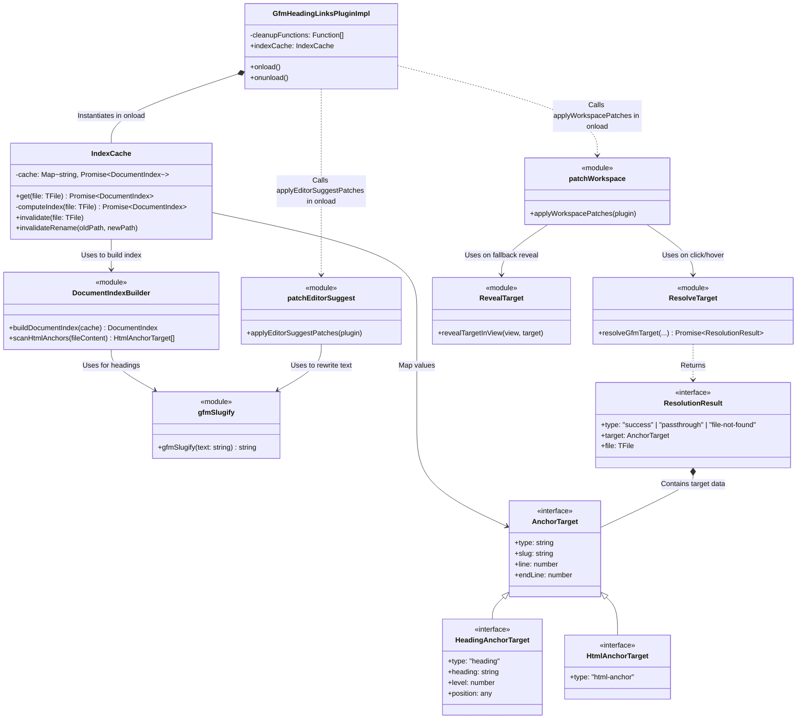
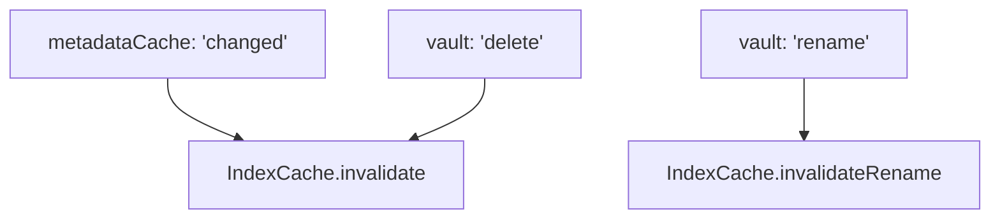
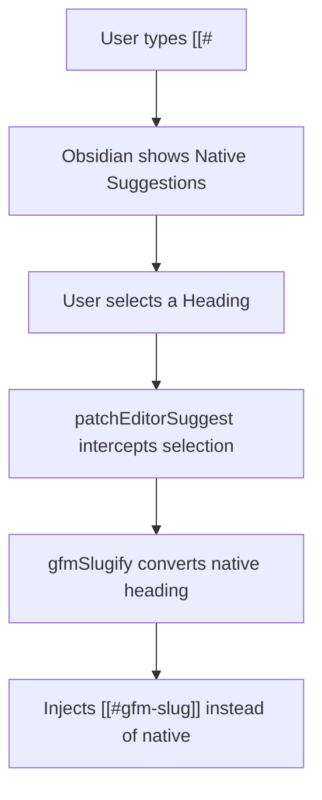
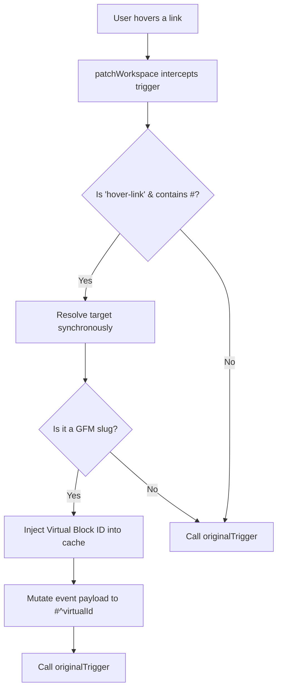
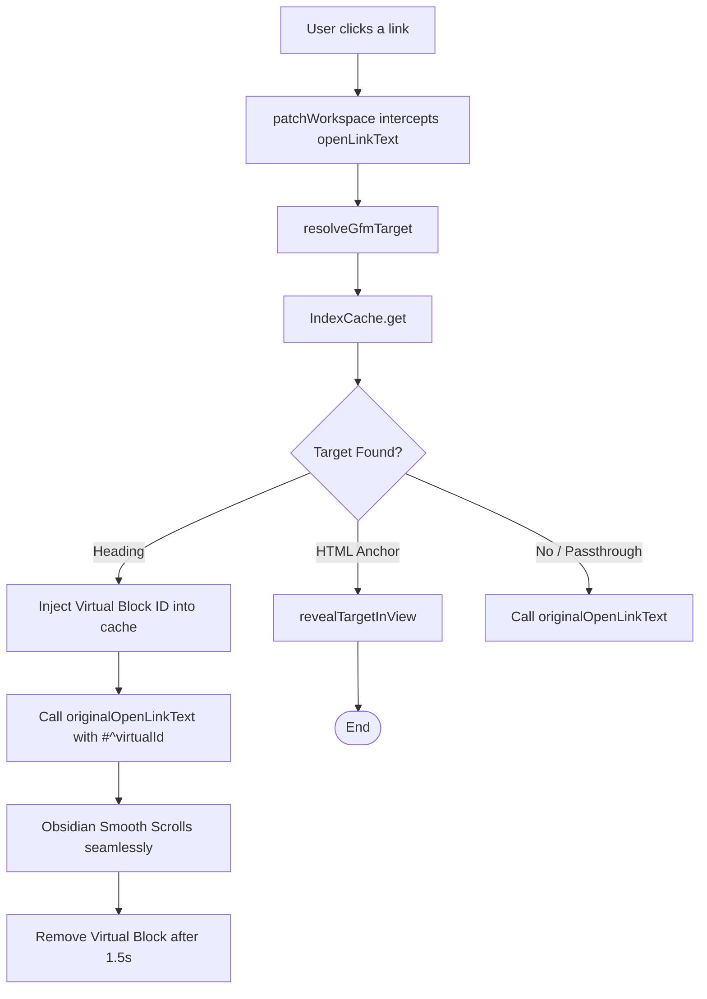
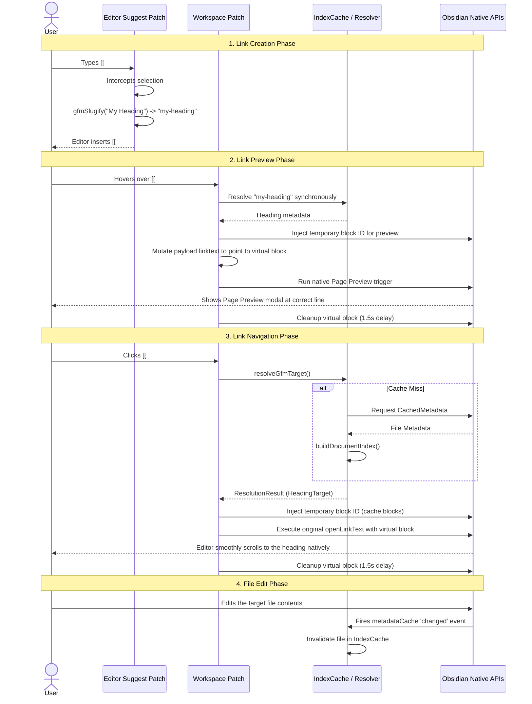

# GFM Heading Links Architecture (Complete System)

These updated diagrams map out **all** interactions across the plugin's lifecycle, including editor auto-completion, page preview hovers, cache invalidations, and link clicks.

## 1. System Class & Module Diagram

This diagram outlines the complete structure of the plugin, including the standalone modules, caching systems, and data models. It specifically details how the `onload` method interacts with the external patching modules.

## 2. Interaction Flowcharts

To make the distinct systems easier to read, the global flowchart has been separated into four independent interaction domains.

### 2.1 Background Event Listeners (Cache Invalidation)

### 2.2 Editor Auto-Suggest (Typing Links)

### 2.3 Page Preview (Hovering Links)

### 2.4 Link Click Navigation

## 3. Full Lifecycle Sequence Diagram

This sequence diagram illustrates the temporal lifecycle of the plugin, from writing a link to reading it, rendering it, and updating the cache when it changes.

