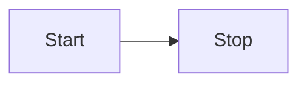

## /home/lucas_galdino/.agents/skills/obsidian/obsidian-plugins/references/Reference/typescript API/HoverLinkSource.md

````markdown
---
aliases: "HoverLinkSource"
cssclasses: hide-title
---

<!-- Do not edit this file. It is automatically generated by API Documenter. -->

[`HoverLinkSource`](HoverLinkSource)

## HoverLinkSource interface


**Signature:**

```typescript
export interface HoverLinkSource
```

## Properties

|  Property | Modifiers | Type | Description |
|  --- | --- | --- | --- |
|  [`defaultMod`](HoverLinkSource/defaultMod) |  | <code>boolean</code> | Whether the <code>hover-link</code> event requires the 'Mod' key to be pressed to trigger. |
|  [`display`](HoverLinkSource/display) |  | <code>string</code> | Text displayed in the 'Page preview' plugin settings. It should match the plugin's display name. |

````

---

## /home/lucas_galdino/.agents/skills/obsidian/obsidian-plugins/references/Reference/typescript API/HoverLinkSource/defaultMod.md

````markdown

---
aliases: "HoverLinkSource.defaultMod"
cssclasses: hide-title
---

<!-- Do not edit this file. It is automatically generated by API Documenter. -->

[`HoverLinkSource`](HoverLinkSource) › [`defaultMod`](HoverLinkSource/defaultMod)

## HoverLinkSource.defaultMod property

Whether the `hover-link` event requires the 'Mod' key to be pressed to trigger.

**Signature:**

```typescript
defaultMod: boolean;
```

````

---

## /home/lucas_galdino/.agents/skills/obsidian/obsidian-plugins/references/Reference/typescript API/HoverLinkSource/display.md

````markdown

---
aliases: "HoverLinkSource.display"
cssclasses: hide-title
---

<!-- Do not edit this file. It is automatically generated by API Documenter. -->

[`HoverLinkSource`](HoverLinkSource) › [`display`](HoverLinkSource/display)

## HoverLinkSource.display property

Text displayed in the 'Page preview' plugin settings. It should match the plugin's display name.

**Signature:**

```typescript
display: string;
```

````

---

## /home/lucas_galdino/.agents/skills/obsidian/obsidian-plugins/references/Reference/typescript API/HoverParent.md

````markdown
---
aliases: "HoverParent"
cssclasses: hide-title
---

<!-- Do not edit this file. It is automatically generated by API Documenter. -->

[`HoverParent`](HoverParent)

## HoverParent interface

 0.11.13

**Signature:**

```typescript
export interface HoverParent
```

## Properties

|  Property | Modifiers | Type | Description |
|  --- | --- | --- | --- |
|  [`hoverPopover`](HoverParent/hoverPopover) |  | [`HoverPopover`](HoverPopover)<code> &#124; null</code> |  0.11.13 |

````

---

## /home/lucas_galdino/.agents/skills/obsidian/obsidian-plugins/references/Reference/typescript API/HoverParent/hoverPopover.md

````markdown
---
aliases: "HoverParent.hoverPopover"
cssclasses: hide-title
---

<!-- Do not edit this file. It is automatically generated by API Documenter. -->

[`HoverParent`](HoverParent) › [`hoverPopover`](HoverParent/hoverPopover)

## HoverParent.hoverPopover property

 0.11.13

**Signature:**

```typescript
hoverPopover: HoverPopover | null;
```

````

---

## /home/lucas_galdino/.agents/skills/obsidian/obsidian-plugins/references/Reference/typescript API/HoverPopover.md

````markdown
---
aliases: "HoverPopover"
cssclasses: hide-title
---

<!-- Do not edit this file. It is automatically generated by API Documenter. -->

[`HoverPopover`](HoverPopover)

## HoverPopover class

 0.15.0

**Signature:**

```typescript
export class HoverPopover extends Component
```

**Extends:** [`Component`](Component)

## Constructors

|  Constructor | Modifiers | Description |
|  --- | --- | --- |
|  [`(constructor)(parent, targetEl, waitTime, staticPos)`](HoverPopover/(constructor).md) |  | Constructs a new instance of the <code>HoverPopover</code> class |

## Properties

|  Property | Modifiers | Type | Description |
|  --- | --- | --- | --- |
|  [`hoverEl`](HoverPopover/hoverEl) |  | <code>HTMLElement</code> |  |
|  [`state`](HoverPopover/state) |  | [`PopoverState`](PopoverState) |  |

## Methods

|  Method | Modifiers | Description |
|  --- | --- | --- |
|  [`addChild(component)`](Component/addChild) |  | <p>Adds a child component, loading it if this component is loaded</p><p> 0.12.0</p><p>(Inherited from [Component](Component)<!-- -->)</p> |
|  [`load()`](Component/load) |  | <p>Load this component and its children</p><p> 0.9.7</p><p>(Inherited from [Component](Component)<!-- -->)</p> |
|  [`onload()`](Component/onload) |  | <p>Override this to load your component</p><p> 0.9.7</p><p>(Inherited from [Component](Component)<!-- -->)</p> |
|  [`onunload()`](Component/onunload) |  | <p>Override this to unload your component</p><p> 0.9.7</p><p>(Inherited from [Component](Component)<!-- -->)</p> |
|  [`register(cb)`](Component/register) |  | <p>Registers a callback to be called when unloading</p><p> 0.9.7</p><p>(Inherited from [Component](Component)<!-- -->)</p> |
|  [`registerDomEvent(el, type, callback, options)`](Component/registerDomEvent) |  | <p>Registers a DOM event to be detached when unloading</p><p> 0.14.8</p><p>(Inherited from [Component](Component)<!-- -->)</p> |
|  [`registerDomEvent(el, type, callback, options)`](Component/registerDomEvent_1) |  | <p>Registers a DOM event to be detached when unloading</p><p> 0.14.8</p><p>(Inherited from [Component](Component)<!-- -->)</p> |
|  [`registerDomEvent(el, type, callback, options)`](Component/registerDomEvent_2) |  | <p>Registers a DOM event to be detached when unloading</p><p> 0.14.8</p><p>(Inherited from [Component](Component)<!-- -->)</p> |
|  [`registerEvent(eventRef)`](Component/registerEvent) |  | <p>Registers an event to be detached when unloading</p><p> 0.9.7</p><p>(Inherited from [Component](Component)<!-- -->)</p> |
|  [`registerInterval(id)`](Component/registerInterval) |  | <p>Registers an interval (from setInterval) to be cancelled when unloading Use  instead of  to avoid typescript confusing between NodeJS vs Browser API</p><p> 0.13.8</p><p>(Inherited from [Component](Component)<!-- -->)</p> |
|  [`removeChild(component)`](Component/removeChild) |  | <p>Removes a child component, unloading it</p><p> 0.12.0</p><p>(Inherited from [Component](Component)<!-- -->)</p> |
|  [`unload()`](Component/unload) |  | <p>Unload this component and its children</p><p> 0.9.7</p><p>(Inherited from [Component](Component)<!-- -->)</p> |

````

---

## /home/lucas_galdino/.agents/skills/obsidian/obsidian-plugins/references/Reference/typescript API/HoverPopover/(constructor).md

````markdown
---
aliases: "HoverPopover.(constructor)"
cssclasses: hide-title
---

<!-- Do not edit this file. It is automatically generated by API Documenter. -->

[`HoverPopover`](HoverPopover) › [`(constructor)`](HoverPopover/(constructor).md)

## HoverPopover.(constructor)

Constructs a new instance of the `HoverPopover` class

**Signature:**

```typescript
constructor(parent: HoverParent, targetEl: HTMLElement | null, waitTime?: number, staticPos?: Point | null);
```

## Parameters

|  Parameter | Type | Description |
|  --- | --- | --- |
|  <code>parent</code> | [`HoverParent`](HoverParent) |  |
|  <code>targetEl</code> | <code>HTMLElement</code><code> &#124; null</code> |  |
|  <code>waitTime</code> | <code>number</code> | _(Optional)_ |
|  <code>staticPos</code> | [`Point`](Point)<code> &#124; null</code> | _(Optional)_ |

````

---

## /home/lucas_galdino/.agents/skills/obsidian/obsidian-plugins/references/Reference/typescript API/HoverPopover/hoverEl.md

````markdown
---
aliases: "HoverPopover.hoverEl"
cssclasses: hide-title
---

<!-- Do not edit this file. It is automatically generated by API Documenter. -->

[`HoverPopover`](HoverPopover) › [`hoverEl`](HoverPopover/hoverEl)

## HoverPopover.hoverEl property


**Signature:**

```typescript
hoverEl: HTMLElement;
```

````

---

## /home/lucas_galdino/.agents/skills/obsidian/obsidian-plugins/references/Reference/typescript API/HoverPopover/state.md

````markdown
---
aliases: "HoverPopover.state"
cssclasses: hide-title
---

<!-- Do not edit this file. It is automatically generated by API Documenter. -->

[`HoverPopover`](HoverPopover) › [`state`](HoverPopover/state)

## HoverPopover.state property


**Signature:**

```typescript
state: PopoverState;
```

````

---

## /home/lucas_galdino/.agents/skills/obsidian/obsidian-plugins/references/Reference/typescript API/PopoverState.md

````markdown
---
aliases: "PopoverState"
cssclasses: hide-title
---

<!-- Do not edit this file. It is automatically generated by API Documenter. -->

[`PopoverState`](PopoverState)

## PopoverState enum


**Signature:**

```typescript
export enum PopoverState
```

````

---

## /home/lucas_galdino/.agents/skills/obsidian/obsidian-plugins/references/Reference/typescript API/Plugin/registerHoverLinkSource.md

````markdown
---
aliases: "Plugin.registerHoverLinkSource"
cssclasses: hide-title
---

<!-- Do not edit this file. It is automatically generated by API Documenter. -->

[`Plugin`](Plugin) › [`registerHoverLinkSource`](Plugin/registerHoverLinkSource)

## Plugin.registerHoverLinkSource() method

Registers a view with the 'Page preview' core plugin as an emitter of the 'hover-link' event.

 1.1.0

**Signature:**

```typescript
registerHoverLinkSource(id: string, info: HoverLinkSource): void;
```

## Parameters

|  Parameter | Type | Description |
|  --- | --- | --- |
|  <code>id</code> | <code>string</code> |  |
|  <code>info</code> | [`HoverLinkSource`](HoverLinkSource) |  |

**Returns:**

`void`

````

---

## /home/lucas_galdino/.agents/skills/obsidian/obsidian-plugins/references/Reference/typescript API/MarkdownView.md

````markdown
---
aliases: "MarkdownView"
cssclasses: hide-title
---

<!-- Do not edit this file. It is automatically generated by API Documenter. -->

[`MarkdownView`](MarkdownView)

## MarkdownView class


**Signature:**

```typescript
export class MarkdownView extends TextFileView implements MarkdownFileInfo
```

**Extends:** [`TextFileView`](TextFileView)

**Implements:** [`MarkdownFileInfo`](MarkdownFileInfo)

## Constructors

|  Constructor | Modifiers | Description |
|  --- | --- | --- |
|  [`(constructor)(leaf)`](MarkdownView/(constructor).md) |  | Constructs a new instance of the <code>MarkdownView</code> class |

## Properties

|  Property | Modifiers | Type | Description |
|  --- | --- | --- | --- |
|  [`allowNoFile`](FileView/allowNoFile) |  | <code>boolean</code> | <p>(Inherited from [FileView](FileView)<!-- -->)</p> |
|  [`app`](View/app) |  | [`App`](App) | <p> 0.9.7</p><p>(Inherited from [View](View)<!-- -->)</p> |
|  [`containerEl`](View/containerEl) |  | <code>HTMLElement</code> | <p> 0.9.7</p><p>(Inherited from [View](View)<!-- -->)</p> |
|  [`contentEl`](ItemView/contentEl) |  | <code>HTMLElement</code> | <p>(Inherited from [ItemView](ItemView)<!-- -->)</p> |
|  [`currentMode`](MarkdownView/currentMode) |  | [`MarkdownSubView`](MarkdownSubView) |  |
|  [`data`](TextFileView/data) |  | <code>string</code> | <p>In memory data</p><p> 0.10.12</p><p>(Inherited from [TextFileView](TextFileView)<!-- -->)</p> |
|  [`editor`](MarkdownView/editor) |  | [`Editor`](Editor) |  |
|  [`file`](FileView/file) |  | [`TFile`](TFile)<code> &#124; null</code> | <p>(Inherited from [FileView](FileView)<!-- -->)</p> |
|  [`hoverPopover`](MarkdownView/hoverPopover) |  | [`HoverPopover`](HoverPopover)<code> &#124; null</code> |  |
|  [`icon`](View/icon) |  | [`IconName`](IconName) | <p> 1.1.0</p><p>(Inherited from [View](View)<!-- -->)</p> |
|  [`leaf`](View/leaf) |  | [`WorkspaceLeaf`](WorkspaceLeaf) | <p> 0.9.7</p><p>(Inherited from [View](View)<!-- -->)</p> |
|  [`navigation`](FileView/navigation) |  | <code>boolean</code> | <p>File views can be navigated by default. </p><p>(Inherited from [FileView](FileView)<!-- -->)</p> |
|  [`previewMode`](MarkdownView/previewMode) |  | [`MarkdownPreviewView`](MarkdownPreviewView) |  |
|  [`requestSave`](TextFileView/requestSave) |  | <code>() =&gt; void</code> | <p>Debounced save in 2 seconds from now</p><p> 0.10.12</p><p>(Inherited from [TextFileView](TextFileView)<!-- -->)</p> |
|  [`scope`](View/scope) |  | [`Scope`](Scope)<code> &#124; null</code> | <p>Assign an optional scope to your view to register hotkeys for when the view is in focus.</p><p>(Inherited from [View](View)<!-- -->)</p> |

## Methods

|  Method | Modifiers | Description |
|  --- | --- | --- |
|  [`addAction(icon, title, callback)`](ItemView/addAction) |  | <p> 1.1.0</p><p>(Inherited from [ItemView](ItemView)<!-- -->)</p> |
|  [`addChild(component)`](Component/addChild) |  | <p>Adds a child component, loading it if this component is loaded</p><p> 0.12.0</p><p>(Inherited from [Component](Component)<!-- -->)</p> |
|  [`canAcceptExtension(extension)`](FileView/canAcceptExtension) |  | <p> 0.9.7</p><p>(Inherited from [FileView](FileView)<!-- -->)</p> |
|  [`clear()`](MarkdownView/clear) |  |  |
|  [`getDisplayText()`](FileView/getDisplayText) |  | <p>(Inherited from [FileView](FileView)<!-- -->)</p> |
|  [`getEphemeralState()`](View/getEphemeralState) |  | <p> 0.9.7</p><p>(Inherited from [View](View)<!-- -->)</p> |
|  [`getIcon()`](View/getIcon) |  | <p> 1.1.0</p><p>(Inherited from [View](View)<!-- -->)</p> |
|  [`getMode()`](MarkdownView/getMode) |  |  |
|  [`getState()`](FileView/getState) |  | <p>(Inherited from [FileView](FileView)<!-- -->)</p> |
|  [`getViewData()`](MarkdownView/getViewData) |  |  |
|  [`getViewType()`](MarkdownView/getViewType) |  |  |
|  [`load()`](Component/load) |  | <p>Load this component and its children</p><p> 0.9.7</p><p>(Inherited from [Component](Component)<!-- -->)</p> |
|  [`onClose()`](View/onClose) | <code>protected</code> | <p> 0.9.7</p><p>(Inherited from [View](View)<!-- -->)</p> |
|  [`onload()`](FileView/onload) |  | <p>(Inherited from [FileView](FileView)<!-- -->)</p> |
|  [`onLoadFile(file)`](TextFileView/onLoadFile) |  | <p> 0.10.12</p><p>(Inherited from [TextFileView](TextFileView)<!-- -->)</p> |
|  [`onOpen()`](View/onOpen) | <code>protected</code> | <p> 0.9.7</p><p>(Inherited from [View](View)<!-- -->)</p> |
|  [`onPaneMenu(menu, source)`](View/onPaneMenu) |  | <p>Populates the pane menu.</p><p>(Replaces the previously removed <code>onHeaderMenu</code> and <code>onMoreOptionsMenu</code>)</p><p> 0.15.3</p><p>(Inherited from [View](View)<!-- -->)</p> |
|  [`onRename(file)`](FileView/onRename) |  | <p>(Inherited from [FileView](FileView)<!-- -->)</p> |
|  [`onResize()`](View/onResize) |  | <p>Called when the size of this view is changed.</p><p> 0.9.7</p><p>(Inherited from [View](View)<!-- -->)</p> |
|  [`onunload()`](Component/onunload) |  | <p>Override this to unload your component</p><p> 0.9.7</p><p>(Inherited from [Component](Component)<!-- -->)</p> |
|  [`onUnloadFile(file)`](TextFileView/onUnloadFile) |  | <p> 0.10.12</p><p>(Inherited from [TextFileView](TextFileView)<!-- -->)</p> |
|  [`register(cb)`](Component/register) |  | <p>Registers a callback to be called when unloading</p><p> 0.9.7</p><p>(Inherited from [Component](Component)<!-- -->)</p> |
|  [`registerDomEvent(el, type, callback, options)`](Component/registerDomEvent) |  | <p>Registers a DOM event to be detached when unloading</p><p> 0.14.8</p><p>(Inherited from [Component](Component)<!-- -->)</p> |
|  [`registerDomEvent(el, type, callback, options)`](Component/registerDomEvent_1) |  | <p>Registers a DOM event to be detached when unloading</p><p> 0.14.8</p><p>(Inherited from [Component](Component)<!-- -->)</p> |
|  [`registerDomEvent(el, type, callback, options)`](Component/registerDomEvent_2) |  | <p>Registers a DOM event to be detached when unloading</p><p> 0.14.8</p><p>(Inherited from [Component](Component)<!-- -->)</p> |
|  [`registerEvent(eventRef)`](Component/registerEvent) |  | <p>Registers an event to be detached when unloading</p><p> 0.9.7</p><p>(Inherited from [Component](Component)<!-- -->)</p> |
|  [`registerInterval(id)`](Component/registerInterval) |  | <p>Registers an interval (from setInterval) to be cancelled when unloading Use  instead of  to avoid typescript confusing between NodeJS vs Browser API</p><p> 0.13.8</p><p>(Inherited from [Component](Component)<!-- -->)</p> |
|  [`removeChild(component)`](Component/removeChild) |  | <p>Removes a child component, unloading it</p><p> 0.12.0</p><p>(Inherited from [Component](Component)<!-- -->)</p> |
|  [`save(clear)`](TextFileView/save) |  | <p> 0.10.12</p><p>(Inherited from [TextFileView](TextFileView)<!-- -->)</p> |
|  [`setEphemeralState(state)`](View/setEphemeralState) |  | <p> 0.9.7</p><p>(Inherited from [View](View)<!-- -->)</p> |
|  [`setState(state, result)`](FileView/setState) |  | <p> 0.9.7</p><p>(Inherited from [FileView](FileView)<!-- -->)</p> |
|  [`setViewData(data, clear)`](MarkdownView/setViewData) |  |  |
|  [`showSearch(replace)`](MarkdownView/showSearch) |  |  |
|  [`unload()`](Component/unload) |  | <p>Unload this component and its children</p><p> 0.9.7</p><p>(Inherited from [Component](Component)<!-- -->)</p> |

````

---

## /home/lucas_galdino/.agents/skills/obsidian/obsidian-plugins/references/Reference/typescript API/Plugin.md

````markdown
---
aliases: "Plugin"
cssclasses: hide-title
---

<!-- Do not edit this file. It is automatically generated by API Documenter. -->

[`Plugin`](Plugin)

## Plugin class

 0.9.7

**Signature:**

```typescript
export abstract class Plugin extends Component
```

**Extends:** [`Component`](Component)

## Constructors

|  Constructor | Modifiers | Description |
|  --- | --- | --- |
|  [`(constructor)(app, manifest)`](Plugin/(constructor).md) |  | Constructs a new instance of the <code>Plugin</code> class |

## Properties

|  Property | Modifiers | Type | Description |
|  --- | --- | --- | --- |
|  [`app`](Plugin/app) |  | [`App`](App) |  0.9.7 |
|  [`manifest`](Plugin/manifest) |  | [`PluginManifest`](PluginManifest) |  0.9.7 |

## Methods

|  Method | Modifiers | Description |
|  --- | --- | --- |
|  [`addChild(component)`](Component/addChild) |  | <p>Adds a child component, loading it if this component is loaded</p><p> 0.12.0</p><p>(Inherited from [Component](Component)<!-- -->)</p> |
|  [`addCommand(command)`](Plugin/addCommand) |  | <p>Register a command globally. Registered commands will be available from the . The command id and name will be automatically prefixed with this plugin's id and name.</p><p> 0.9.7</p> |
|  [`addRibbonIcon(icon, title, callback)`](Plugin/addRibbonIcon) |  | Adds a ribbon icon to the left bar. |
|  [`addSettingTab(settingTab)`](Plugin/addSettingTab) |  | Register a settings tab, which allows users to change settings. |
|  [`addStatusBarItem()`](Plugin/addStatusBarItem) |  | Adds a status bar item to the bottom of the app. Not available on mobile. |
|  [`load()`](Component/load) |  | <p>Load this component and its children</p><p> 0.9.7</p><p>(Inherited from [Component](Component)<!-- -->)</p> |
|  [`loadData()`](Plugin/loadData) |  | Load settings data from disk. Data is stored in <code>data.json</code> in the plugin folder. |
|  [`onExternalSettingsChange()?`](Plugin/onExternalSettingsChange) |  | <p>_(Optional)_ Called when the <code>data.json</code> file is modified on disk externally from Obsidian. This usually means that a Sync service or external program has modified the plugin settings.</p><p>Implement this method to reload plugin settings when they have changed externally.</p><p> 1.5.7</p> |
|  [`onload()`](Plugin/onload) |  |  0.9.7 |
|  [`onunload()`](Component/onunload) |  | <p>Override this to unload your component</p><p> 0.9.7</p><p>(Inherited from [Component](Component)<!-- -->)</p> |
|  [`onUserEnable()`](Plugin/onUserEnable) |  | <p>Perform any initial setup code. The user has explicitly interacted with the plugin so its safe to engage with the user. If your plugin registers a custom view, you can open it here.</p><p> 1.7.2</p> |
|  [`register(cb)`](Component/register) |  | <p>Registers a callback to be called when unloading</p><p> 0.9.7</p><p>(Inherited from [Component](Component)<!-- -->)</p> |
|  [`registerBasesView(viewId, registration)`](Plugin/registerBasesView) |  | Register a Base view handler that can be used to render data from property queries. |
|  [`registerCliHandler(command, description, flags, handler)`](Plugin/registerCliHandler) |  | <p>Register a CLI handler to handle a command from the CLI. Command IDs must be globally unique. Attempting to register a command that is already registered will throw an Error.</p><p>Use the format <code>&lt;plugin-id&gt;</code> for your default command, and <code>&lt;plugin-id&gt;:&lt;action&gt;</code> for sub-commands and actions.</p> |
|  [`registerDomEvent(el, type, callback, options)`](Component/registerDomEvent) |  | <p>Registers a DOM event to be detached when unloading</p><p> 0.14.8</p><p>(Inherited from [Component](Component)<!-- -->)</p> |
|  [`registerDomEvent(el, type, callback, options)`](Component/registerDomEvent_1) |  | <p>Registers a DOM event to be detached when unloading</p><p> 0.14.8</p><p>(Inherited from [Component](Component)<!-- -->)</p> |
|  [`registerDomEvent(el, type, callback, options)`](Component/registerDomEvent_2) |  | <p>Registers a DOM event to be detached when unloading</p><p> 0.14.8</p><p>(Inherited from [Component](Component)<!-- -->)</p> |
|  [`registerEditorExtension(extension)`](Plugin/registerEditorExtension) |  | Registers a CodeMirror 6 extension. To reconfigure cm6 extensions for a plugin on the fly, an array should be passed in, and modified dynamically. Once this array is modified, calling [Workspace.updateOptions()](Workspace/updateOptions) will apply the changes. |
|  [`registerEditorSuggest(editorSuggest)`](Plugin/registerEditorSuggest) |  | <p>Register an EditorSuggest which can provide live suggestions while the user is typing.</p><p> 0.12.7</p> |
|  [`registerEvent(eventRef)`](Component/registerEvent) |  | <p>Registers an event to be detached when unloading</p><p> 0.9.7</p><p>(Inherited from [Component](Component)<!-- -->)</p> |
|  [`registerExtensions(extensions, viewType)`](Plugin/registerExtensions) |  |  0.9.7 |
|  [`registerHoverLinkSource(id, info)`](Plugin/registerHoverLinkSource) |  | <p>Registers a view with the 'Page preview' core plugin as an emitter of the 'hover-link' event.</p><p> 1.1.0</p> |
|  [`registerInterval(id)`](Component/registerInterval) |  | <p>Registers an interval (from setInterval) to be cancelled when unloading Use  instead of  to avoid typescript confusing between NodeJS vs Browser API</p><p> 0.13.8</p><p>(Inherited from [Component](Component)<!-- -->)</p> |
|  [`registerMarkdownCodeBlockProcessor(language, handler, sortOrder)`](Plugin/registerMarkdownCodeBlockProcessor) |  | Register a special post processor that handles fenced code given a language and a handler. This special post processor takes care of removing the <code>&lt;pre&gt;&lt;code&gt;</code> and create a <code>&lt;div&gt;</code> that will be passed to the handler, and is expected to be filled with custom elements. |
|  [`registerMarkdownPostProcessor(postProcessor, sortOrder)`](Plugin/registerMarkdownPostProcessor) |  | Registers a post processor, to change how the document looks in reading mode. |
|  [`registerObsidianProtocolHandler(action, handler)`](Plugin/registerObsidianProtocolHandler) |  | Register a handler for obsidian:// URLs. |
|  [`registerView(type, viewCreator)`](Plugin/registerView) |  |  0.9.7 |
|  [`removeChild(component)`](Component/removeChild) |  | <p>Removes a child component, unloading it</p><p> 0.12.0</p><p>(Inherited from [Component](Component)<!-- -->)</p> |
|  [`removeCommand(commandId)`](Plugin/removeCommand) |  | <p>Manually remove a command from the list of global commands. This should not be needed unless your plugin registers commands dynamically.</p><p> 1.7.2</p> |
|  [`saveData(data)`](Plugin/saveData) |  | Write settings data to disk. Data is stored in <code>data.json</code> in the plugin folder. |
|  [`unload()`](Component/unload) |  | <p>Unload this component and its children</p><p> 0.9.7</p><p>(Inherited from [Component](Component)<!-- -->)</p> |

````

---

## /home/lucas_galdino/.agents/skills/obsidian/obsidian-plugins/references/Reference/typescript API/Events.md

````markdown
---
aliases: "Events"
cssclasses: hide-title
---

<!-- Do not edit this file. It is automatically generated by API Documenter. -->

[`Events`](Events)

## Events class

 0.9.7

**Signature:**

```typescript
export class Events
```

## Methods

|  Method | Modifiers | Description |
|  --- | --- | --- |
|  [`off(name, callback)`](Events/off) |  |  0.9.7 |
|  [`offref(ref)`](Events/offref) |  |  0.9.7 |
|  [`on(name: string, callback, ctx)`](Events/on) |  |  0.9.7 |
|  [`trigger(name, data)`](Events/trigger) |  |  0.9.7 |
|  [`tryTrigger(evt, args)`](Events/tryTrigger) |  |  0.9.7 |

````

---

All 14 files have been read and returned in full.Here are all 12 files, complete and unmodified:

---

## /home/lucas_galdino/.agents/skills/obsidian/obsidian-plugins/references/Reference/typescript API/MarkdownPostProcessor.md

````markdown
---
aliases: "MarkdownPostProcessor"
cssclasses: hide-title
---

<!-- Do not edit this file. It is automatically generated by API Documenter. -->

[`MarkdownPostProcessor`](MarkdownPostProcessor)

## MarkdownPostProcessor interface

A post processor receives an element which is a section of the preview.

Post processors can mutate the DOM to render various things, such as mermaid graphs, latex equations, or custom controls.

If your post processor requires lifecycle management, for example, to clear an interval, kill a subprocess, etc when this element is removed from the app, look into [MarkdownPostProcessorContext.addChild()](MarkdownPostProcessorContext/addChild)

 0.10.12

**Signature:**

```typescript
export interface MarkdownPostProcessor
```

## Properties

|  Property | Modifiers | Type | Description |
|  --- | --- | --- | --- |
|  [`sortOrder?`](MarkdownPostProcessor/sortOrder) |  | <code>number</code> | _(Optional)_ An optional integer sort order. Defaults to 0. Lower number runs before higher numbers. |

````

---

## /home/lucas_galdino/.agents/skills/obsidian/obsidian-plugins/references/Reference/typescript API/MarkdownPostProcessorContext.md

````markdown
---
aliases: "MarkdownPostProcessorContext"
cssclasses: hide-title
---

<!-- Do not edit this file. It is automatically generated by API Documenter. -->

[`MarkdownPostProcessorContext`](MarkdownPostProcessorContext)

## MarkdownPostProcessorContext interface


**Signature:**

```typescript
export interface MarkdownPostProcessorContext
```

## Properties

|  Property | Modifiers | Type | Description |
|  --- | --- | --- | --- |
|  [`docId`](MarkdownPostProcessorContext/docId) |  | <code>string</code> |  |
|  [`frontmatter`](MarkdownPostProcessorContext/frontmatter) |  | <code>any &#124; null &#124; undefined</code> |  |
|  [`sourcePath`](MarkdownPostProcessorContext/sourcePath) |  | <code>string</code> | The path to the associated file. Any links are assumed to be relative to the <code>sourcePath</code>. |

## Methods

|  Method | Description |
|  --- | --- |
|  [`addChild(child)`](MarkdownPostProcessorContext/addChild) | <p>Adds a child component that will have its lifecycle managed by the renderer.</p><p>Use this to add a dependent child to the renderer such that if the containerEl of the child is ever removed, the component's unload will be called.</p> |
|  [`getSectionInfo(el)`](MarkdownPostProcessorContext/getSectionInfo) | Gets the section information of this element at this point in time. Only call this function right before you need this information to get the most up-to-date version. This function may also return null in many circumstances; if you use it, you must be prepared to deal with nulls. |

````

---

## /home/lucas_galdino/.agents/skills/obsidian/obsidian-plugins/references/Reference/typescript API/MarkdownPreviewRenderer.md

````markdown
---
aliases: "MarkdownPreviewRenderer"
cssclasses: hide-title
---

<!-- Do not edit this file. It is automatically generated by API Documenter. -->

[`MarkdownPreviewRenderer`](MarkdownPreviewRenderer)

## MarkdownPreviewRenderer class

 0.9.7

**Signature:**

```typescript
export class MarkdownPreviewRenderer
```

## Methods

|  Method | Modifiers | Description |
|  --- | --- | --- |
|  [`createCodeBlockPostProcessor(language, handler)`](MarkdownPreviewRenderer/createCodeBlockPostProcessor) | <code>static</code> |  0.12.11 |
|  [`registerPostProcessor(postProcessor, sortOrder)`](MarkdownPreviewRenderer/registerPostProcessor) | <code>static</code> |  0.10.12 |
|  [`unregisterPostProcessor(postProcessor)`](MarkdownPreviewRenderer/unregisterPostProcessor) | <code>static</code> |  0.9.7 |

````

---

## /home/lucas_galdino/.agents/skills/obsidian/obsidian-plugins/references/Reference/typescript API/MarkdownPreviewView.md

````markdown
---
aliases: "MarkdownPreviewView"
cssclasses: hide-title
---

<!-- Do not edit this file. It is automatically generated by API Documenter. -->

[`MarkdownPreviewView`](MarkdownPreviewView)

## MarkdownPreviewView class


**Signature:**

```typescript
export class MarkdownPreviewView extends MarkdownRenderer implements MarkdownSubView, MarkdownPreviewEvents
```

**Extends:** [`MarkdownRenderer`](MarkdownRenderer)

**Implements:** [`MarkdownSubView`](MarkdownSubView)<!-- -->, [`MarkdownPreviewEvents`](MarkdownPreviewEvents)

## Constructors

|  Constructor | Modifiers | Description |
|  --- | --- | --- |
|  [`(constructor)(containerEl)`](MarkdownRenderChild/(constructor).md) |  | <p>Constructs a new instance of the <code>MarkdownRenderChild</code> class</p><p>(Inherited from [MarkdownRenderChild](MarkdownRenderChild)<!-- -->)</p> |

## Properties

|  Property | Modifiers | Type | Description |
|  --- | --- | --- | --- |
|  [`app`](MarkdownRenderer/app) |  | [`App`](App) | <p>(Inherited from [MarkdownRenderer](MarkdownRenderer)<!-- -->)</p> |
|  [`containerEl`](MarkdownPreviewView/containerEl) |  | <code>HTMLElement</code> |  |
|  [`file`](MarkdownPreviewView/file) | <code>readonly</code> | [`TFile`](TFile) |  |
|  [`hoverPopover`](MarkdownRenderer/hoverPopover) |  | [`HoverPopover`](HoverPopover)<code> &#124; null</code> | <p>(Inherited from [MarkdownRenderer](MarkdownRenderer)<!-- -->)</p> |

## Methods

|  Method | Modifiers | Description |
|  --- | --- | --- |
|  [`addChild(component)`](Component/addChild) |  | <p>Adds a child component, loading it if this component is loaded</p><p> 0.12.0</p><p>(Inherited from [Component](Component)<!-- -->)</p> |
|  [`applyScroll(scroll)`](MarkdownPreviewView/applyScroll) |  |  |
|  [`clear()`](MarkdownPreviewView/clear) |  |  |
|  [`get()`](MarkdownPreviewView/get) |  |  |
|  [`getScroll()`](MarkdownPreviewView/getScroll) |  |  |
|  [`load()`](Component/load) |  | <p>Load this component and its children</p><p> 0.9.7</p><p>(Inherited from [Component](Component)<!-- -->)</p> |
|  [`onload()`](Component/onload) |  | <p>Override this to load your component</p><p> 0.9.7</p><p>(Inherited from [Component](Component)<!-- -->)</p> |
|  [`onunload()`](Component/onunload) |  | <p>Override this to unload your component</p><p> 0.9.7</p><p>(Inherited from [Component](Component)<!-- -->)</p> |
|  [`register(cb)`](Component/register) |  | <p>Registers a callback to be called when unloading</p><p> 0.9.7</p><p>(Inherited from [Component](Component)<!-- -->)</p> |
|  [`registerDomEvent(el, type, callback, options)`](Component/registerDomEvent) |  | <p>Registers a DOM event to be detached when unloading</p><p> 0.14.8</p><p>(Inherited from [Component](Component)<!-- -->)</p> |
|  [`registerDomEvent(el, type, callback, options)`](Component/registerDomEvent_1) |  | <p>Registers a DOM event to be detached when unloading</p><p> 0.14.8</p><p>(Inherited from [Component](Component)<!-- -->)</p> |
|  [`registerDomEvent(el, type, callback, options)`](Component/registerDomEvent_2) |  | <p>Registers a DOM event to be detached when unloading</p><p> 0.14.8</p><p>(Inherited from [Component](Component)<!-- -->)</p> |
|  [`registerEvent(eventRef)`](Component/registerEvent) |  | <p>Registers an event to be detached when unloading</p><p> 0.9.7</p><p>(Inherited from [Component](Component)<!-- -->)</p> |
|  [`registerInterval(id)`](Component/registerInterval) |  | <p>Registers an interval (from setInterval) to be cancelled when unloading Use  instead of  to avoid typescript confusing between NodeJS vs Browser API</p><p> 0.13.8</p><p>(Inherited from [Component](Component)<!-- -->)</p> |
|  [`removeChild(component)`](Component/removeChild) |  | <p>Removes a child component, unloading it</p><p> 0.12.0</p><p>(Inherited from [Component](Component)<!-- -->)</p> |
|  [`render(app, markdown, el, sourcePath, component)`](MarkdownRenderer/render) | <code>static</code> | <p>Renders Markdown string to an HTML element.</p><p>(Inherited from [MarkdownRenderer](MarkdownRenderer)<!-- -->)</p> |
|  [`renderMarkdown(markdown, el, sourcePath, component)`](MarkdownRenderer/renderMarkdown) | <code>static</code> | <p>Renders Markdown string to an HTML element.</p><p>(Inherited from [MarkdownRenderer](MarkdownRenderer)<!-- -->)</p> |
|  [`rerender(full)`](MarkdownPreviewView/rerender) |  |  |
|  [`set(data, clear)`](MarkdownPreviewView/set) |  |  |
|  [`unload()`](Component/unload) |  | <p>Unload this component and its children</p><p> 0.9.7</p><p>(Inherited from [Component](Component)<!-- -->)</p> |

````

---

## /home/lucas_galdino/.agents/skills/obsidian/obsidian-plugins/references/Reference/typescript API/MarkdownRenderer.md

````markdown
---
aliases: "MarkdownRenderer"
cssclasses: hide-title
---

<!-- Do not edit this file. It is automatically generated by API Documenter. -->

[`MarkdownRenderer`](MarkdownRenderer)

## MarkdownRenderer class

 0.9.7

**Signature:**

```typescript
export abstract class MarkdownRenderer extends MarkdownRenderChild implements MarkdownPreviewEvents, HoverParent
```

**Extends:** [`MarkdownRenderChild`](MarkdownRenderChild)

**Implements:** [`MarkdownPreviewEvents`](MarkdownPreviewEvents)<!-- -->, [`HoverParent`](HoverParent)

## Constructors

|  Constructor | Modifiers | Description |
|  --- | --- | --- |
|  [`(constructor)(containerEl)`](MarkdownRenderChild/(constructor).md) |  | <p>Constructs a new instance of the <code>MarkdownRenderChild</code> class</p><p>(Inherited from [MarkdownRenderChild](MarkdownRenderChild)<!-- -->)</p> |

## Properties

|  Property | Modifiers | Type | Description |
|  --- | --- | --- | --- |
|  [`app`](MarkdownRenderer/app) |  | [`App`](App) |  |
|  [`containerEl`](MarkdownRenderChild/containerEl) |  | <code>HTMLElement</code> | <p>(Inherited from [MarkdownRenderChild](MarkdownRenderChild)<!-- -->)</p> |
|  [`file`](MarkdownRenderer/file) | <p><code>abstract</code></p><p><code>readonly</code></p> | [`TFile`](TFile) |  |
|  [`hoverPopover`](MarkdownRenderer/hoverPopover) |  | [`HoverPopover`](HoverPopover)<code> &#124; null</code> |  |

## Methods

|  Method | Modifiers | Description |
|  --- | --- | --- |
|  [`addChild(component)`](Component/addChild) |  | <p>Adds a child component, loading it if this component is loaded</p><p> 0.12.0</p><p>(Inherited from [Component](Component)<!-- -->)</p> |
|  [`load()`](Component/load) |  | <p>Load this component and its children</p><p> 0.9.7</p><p>(Inherited from [Component](Component)<!-- -->)</p> |
|  [`onload()`](Component/onload) |  | <p>Override this to load your component</p><p> 0.9.7</p><p>(Inherited from [Component](Component)<!-- -->)</p> |
|  [`onunload()`](Component/onunload) |  | <p>Override this to unload your component</p><p> 0.9.7</p><p>(Inherited from [Component](Component)<!-- -->)</p> |
|  [`register(cb)`](Component/register) |  | <p>Registers a callback to be called when unloading</p><p> 0.9.7</p><p>(Inherited from [Component](Component)<!-- -->)</p> |
|  [`registerDomEvent(el, type, callback, options)`](Component/registerDomEvent) |  | <p>Registers a DOM event to be detached when unloading</p><p> 0.14.8</p><p>(Inherited from [Component](Component)<!-- -->)</p> |
|  [`registerDomEvent(el, type, callback, options)`](Component/registerDomEvent_1) |  | <p>Registers a DOM event to be detached when unloading</p><p> 0.14.8</p><p>(Inherited from [Component](Component)<!-- -->)</p> |
|  [`registerDomEvent(el, type, callback, options)`](Component/registerDomEvent_2) |  | <p>Registers a DOM event to be detached when unloading</p><p> 0.14.8</p><p>(Inherited from [Component](Component)<!-- -->)</p> |
|  [`registerEvent(eventRef)`](Component/registerEvent) |  | <p>Registers an event to be detached when unloading</p><p> 0.9.7</p><p>(Inherited from [Component](Component)<!-- -->)</p> |
|  [`registerInterval(id)`](Component/registerInterval) |  | <p>Registers an interval (from setInterval) to be cancelled when unloading Use  instead of  to avoid typescript confusing between NodeJS vs Browser API</p><p> 0.13.8</p><p>(Inherited from [Component](Component)<!-- -->)</p> |
|  [`removeChild(component)`](Component/removeChild) |  | <p>Removes a child component, unloading it</p><p> 0.12.0</p><p>(Inherited from [Component](Component)<!-- -->)</p> |
|  [`render(app, markdown, el, sourcePath, component)`](MarkdownRenderer/render) | <code>static</code> | Renders Markdown string to an HTML element. |
|  [`renderMarkdown(markdown, el, sourcePath, component)`](MarkdownRenderer/renderMarkdown) | <code>static</code> | Renders Markdown string to an HTML element. |
|  [`unload()`](Component/unload) |  | <p>Unload this component and its children</p><p> 0.9.7</p><p>(Inherited from [Component](Component)<!-- -->)</p> |

````

---

## /home/lucas_galdino/.agents/skills/obsidian/obsidian-plugins/references/Reference/typescript API/MarkdownEditView.md

````markdown
---
aliases: "MarkdownEditView"
cssclasses: hide-title
---

<!-- Do not edit this file. It is automatically generated by API Documenter. -->

[`MarkdownEditView`](MarkdownEditView)

## MarkdownEditView class

This is the editor for Obsidian Mobile as well as the WYSIWYG editor.

**Signature:**

```typescript
export class MarkdownEditView implements MarkdownSubView, HoverParent, MarkdownFileInfo
```

**Implements:** [`MarkdownSubView`](MarkdownSubView)<!-- -->, [`HoverParent`](HoverParent)<!-- -->, [`MarkdownFileInfo`](MarkdownFileInfo)

## Constructors

|  Constructor | Modifiers | Description |
|  --- | --- | --- |
|  [`(constructor)(view)`](MarkdownEditView/(constructor).md) |  | Constructs a new instance of the <code>MarkdownEditView</code> class |

## Properties

|  Property | Modifiers | Type | Description |
|  --- | --- | --- | --- |
|  [`app`](MarkdownEditView/app) |  | [`App`](App) |  |
|  [`file`](MarkdownEditView/file) | <code>readonly</code> | [`TFile`](TFile) |  |
|  [`hoverPopover`](MarkdownEditView/hoverPopover) |  | [`HoverPopover`](HoverPopover) |  |

## Methods

|  Method | Modifiers | Description |
|  --- | --- | --- |
|  [`applyScroll(scroll)`](MarkdownEditView/applyScroll) |  |  |
|  [`clear()`](MarkdownEditView/clear) |  |  |
|  [`get()`](MarkdownEditView/get) |  |  |
|  [`getScroll()`](MarkdownEditView/getScroll) |  |  |
|  [`getSelection()`](MarkdownEditView/getSelection) |  |  |
|  [`set(data, clear)`](MarkdownEditView/set) |  |  |

````

---

## /home/lucas_galdino/.agents/skills/obsidian/obsidian-plugins/references/Reference/typescript API/MarkdownRenderChild.md

````markdown
---
aliases: "MarkdownRenderChild"
cssclasses: hide-title
---

<!-- Do not edit this file. It is automatically generated by API Documenter. -->

[`MarkdownRenderChild`](MarkdownRenderChild)

## MarkdownRenderChild class


**Signature:**

```typescript
export class MarkdownRenderChild extends Component
```

**Extends:** [`Component`](Component)

## Constructors

|  Constructor | Modifiers | Description |
|  --- | --- | --- |
|  [`(constructor)(containerEl)`](MarkdownRenderChild/(constructor).md) |  | Constructs a new instance of the <code>MarkdownRenderChild</code> class |

## Properties

|  Property | Modifiers | Type | Description |
|  --- | --- | --- | --- |
|  [`containerEl`](MarkdownRenderChild/containerEl) |  | <code>HTMLElement</code> |  |

## Methods

|  Method | Modifiers | Description |
|  --- | --- | --- |
|  [`addChild(component)`](Component/addChild) |  | <p>Adds a child component, loading it if this component is loaded</p><p> 0.12.0</p><p>(Inherited from [Component](Component)<!-- -->)</p> |
|  [`load()`](Component/load) |  | <p>Load this component and its children</p><p> 0.9.7</p><p>(Inherited from [Component](Component)<!-- -->)</p> |
|  [`onload()`](Component/onload) |  | <p>Override this to load your component</p><p> 0.9.7</p><p>(Inherited from [Component](Component)<!-- -->)</p> |
|  [`onunload()`](Component/onunload) |  | <p>Override this to unload your component</p><p> 0.9.7</p><p>(Inherited from [Component](Component)<!-- -->)</p> |
|  [`register(cb)`](Component/register) |  | <p>Registers a callback to be called when unloading</p><p> 0.9.7</p><p>(Inherited from [Component](Component)<!-- -->)</p> |
|  [`registerDomEvent(el, type, callback, options)`](Component/registerDomEvent) |  | <p>Registers a DOM event to be detached when unloading</p><p> 0.14.8</p><p>(Inherited from [Component](Component)<!-- -->)</p> |
|  [`registerDomEvent(el, type, callback, options)`](Component/registerDomEvent_1) |  | <p>Registers a DOM event to be detached when unloading</p><p> 0.14.8</p><p>(Inherited from [Component](Component)<!-- -->)</p> |
|  [`registerDomEvent(el, type, callback, options)`](Component/registerDomEvent_2) |  | <p>Registers a DOM event to be detached when unloading</p><p> 0.14.8</p><p>(Inherited from [Component](Component)<!-- -->)</p> |
|  [`registerEvent(eventRef)`](Component/registerEvent) |  | <p>Registers an event to be detached when unloading</p><p> 0.9.7</p><p>(Inherited from [Component](Component)<!-- -->)</p> |
|  [`registerInterval(id)`](Component/registerInterval) |  | <p>Registers an interval (from setInterval) to be cancelled when unloading Use  instead of  to avoid typescript confusing between NodeJS vs Browser API</p><p> 0.13.8</p><p>(Inherited from [Component](Component)<!-- -->)</p> |
|  [`removeChild(component)`](Component/removeChild) |  | <p>Removes a child component, unloading it</p><p> 0.12.0</p><p>(Inherited from [Component](Component)<!-- -->)</p> |
|  [`unload()`](Component/unload) |  | <p>Unload this component and its children</p><p> 0.9.7</p><p>(Inherited from [Component](Component)<!-- -->)</p> |

````

---

## /home/lucas_galdino/.agents/skills/obsidian/obsidian-plugins/references/Reference/typescript API/MarkdownPreviewEvents.md

````markdown
---
aliases: "MarkdownPreviewEvents"
cssclasses: hide-title
---

<!-- Do not edit this file. It is automatically generated by API Documenter. -->

[`MarkdownPreviewEvents`](MarkdownPreviewEvents)

## MarkdownPreviewEvents interface

\*

**Signature:**

```typescript
export interface MarkdownPreviewEvents extends Component
```

**Extends:** [`Component`](Component)

````

---

## /home/lucas_galdino/.agents/skills/obsidian/obsidian-plugins/references/Reference/typescript API/MarkdownSubView.md

````markdown
---
aliases: "MarkdownSubView"
cssclasses: hide-title
---

<!-- Do not edit this file. It is automatically generated by API Documenter. -->

[`MarkdownSubView`](MarkdownSubView)

## MarkdownSubView interface


**Signature:**

```typescript
export interface MarkdownSubView
```

## Methods

|  Method | Description |
|  --- | --- |
|  [`applyScroll(scroll)`](MarkdownSubView/applyScroll) |  |
|  [`get()`](MarkdownSubView/get) |  |
|  [`getScroll()`](MarkdownSubView/getScroll) |  |
|  [`set(data, clear)`](MarkdownSubView/set) |  |

````

---

## /home/lucas_galdino/.agents/skills/obsidian/obsidian-plugins/references/Reference/typescript API/RenderContext.md

````markdown
---
aliases: "RenderContext"
cssclasses: hide-title
---

<!-- Do not edit this file. It is automatically generated by API Documenter. -->

[`RenderContext`](RenderContext)

## RenderContext class

Utility functions for rendering Values within the app.

 1.10.0

**Signature:**

```typescript
export class RenderContext implements HoverParent
```

**Implements:** [`HoverParent`](HoverParent)

## Properties

|  Property | Modifiers | Type | Description |
|  --- | --- | --- | --- |
|  [`hoverPopover`](RenderContext/hoverPopover) |  | [`HoverPopover`](HoverPopover)<code> &#124; null</code> |  1.10.0 |

````

---

## /home/lucas_galdino/.agents/skills/obsidian/obsidian-plugins/references/Plugins/Editor/Markdown post processing.md

````markdown
If you want to change how a Markdown document is rendered in Reading view, you can add your own _Markdown post processor_. As indicated by the name, the post processor runs _after_ the Markdown has been processed into HTML. It lets you add, remove, or replace [[HTML elements]] to the rendered document.

The following example looks for any code block that contains a text between two colons, `:`, and replaces it with an appropriate emoji:

```ts
import { Plugin } from 'obsidian';

const ALL_EMOJIS: Record<string, string> = {
  ':+1:': '👍',
  ':sunglasses:': '😎',
  ':smile:': '😄',
};

export default class ExamplePlugin extends Plugin {
  async onload() {
    this.registerMarkdownPostProcessor((element, context) => {
      const codeblocks = element.findAll('code');

      for (let codeblock of codeblocks) {
        const text = codeblock.innerText.trim();
        if (text[0] === ':' && text[text.length - 1] === ':') {
          const emojiEl = codeblock.createSpan({
            text: ALL_EMOJIS[text] ?? text,
          });
          codeblock.replaceWith(emojiEl);
        }
      }
    });
  }
}
```

## Post-process Markdown code blocks

Did you know that you can create [Mermaid](https://mermaid-js.github.io/) diagrams in Obsidian by creating a `mermaid` code block with a text definition like this one?:

````md

````

If you change to Preview mode, the text in the code block becomes the following diagram:


If you want to add your own custom code blocks like the Mermaid one, you can use [[registerMarkdownCodeBlockProcessor|registerMarkdownCodeBlockProcessor()]]. The following example renders a code block with CSV data, as a table:

```ts
import { Plugin } from 'obsidian';

export default class ExamplePlugin extends Plugin {
  async onload() {
    this.registerMarkdownCodeBlockProcessor('csv', (source, el, ctx) => {
      const rows = source.split('\n').filter((row) => row.length > 0);

      const table = el.createEl('table');
      const body = table.createEl('tbody');

      for (let i = 0; i < rows.length; i++) {
        const cols = rows[i].split(',');

        const row = body.createEl('tr');

        for (let j = 0; j < cols.length; j++) {
          row.createEl('td', { text: cols[j] });
        }
      }
    });
  }
}
```

````

---

## /home/lucas_galdino/.agents/skills/obsidian/obsidian-plugins/references/Plugins/Events.md

````markdown
Many of the interfaces in the Obsidian lets you subscribe to events throughout the application, for example when the user makes changes to a file.

Any registered event handlers need to be detached whenever the plugin unloads. The safest way to make sure this happens is to use the [[registerEvent|registerEvent()]] method.

```ts
import { Plugin } from 'obsidian';

export default class ExamplePlugin extends Plugin {
  async onload() {
    this.registerEvent(this.app.vault.on('create', () => {
      console.log('a new file has entered the arena')
    }));
  }
}
```

## Timing events

If you want to repeatedly call a function with a fixed delay, use the [`window.setInterval()`](https://developer.mozilla.org/en-US/docs/Web/API/setInterval) function with the [[registerInterval|registerInterval()]] method.

The following example displays the current time in the status bar, updated every second:

```ts
import { moment, Plugin } from 'obsidian';

export default class ExamplePlugin extends Plugin {
  statusBar: HTMLElement;

  async onload() {
    this.statusBar = this.addStatusBarItem();

    this.updateStatusBar();

    this.registerInterval(
      window.setInterval(() => this.updateStatusBar(), 1000)
    );
  }

  updateStatusBar() {
    this.statusBar.setText(moment().format('H:mm:ss'));
  }
}
```

> [!tip] Date and time
> [Moment](https://momentjs.com/) is a popular javascript library for working with dates and time. Obsidian uses Moment internally, so you don't need to install it yourself. You can import it from the Obsidian API instead:
>
> ```ts
> import { moment } from 'obsidian';
> ```
>
````

---

All 12 files have been returned in full, with no omissions or summaries.Here is the complete content of all 12 files:

---

## /home/lucas_galdino/.agents/skills/obsidian/obsidian-plugins/references/Plugins/Editor/Editor extensions.md

````

---

aliases: editor extension
---

Editor extensions let you customize the experience of editing notes in Obsidian. This page explains what editor extensions are, and when to use them.

Obsidian uses CodeMirror 6 (CM6) to power the Markdown editor. Just like Obsidian, CM6 has plugins of its own, called _extensions_. In other words, an Obsidian _editor extension_ is the same thing as a _CodeMirror 6 extension_.

The API for building editor extensions is a bit unconventional and requires that you have a basic understanding of its architecture before you get started. This section aims to give you enough context and examples for you to get started. If you want to learn more about building editor extensions, refer to the [CodeMirror 6 documentation](https://codemirror.net/docs/).

## Do I need an editor extension?

Building editor extensions can be challenging, so before you start building one, consider whether you really need it.

- If you want to change how to convert Markdown to HTML in the Reading view, consider building a [[Markdown post processing|Markdown post processor]].
- If you want to change how the document looks and feels in Live Preview, you need to build an editor extension.

## Registering editor extensions

CodeMirror 6 (CM6) is a powerful engine for editing code using web technologies. At its core, the editor itself has a minimal set of features. Any features you'd expect from a modern editor are available as _extensions_ that you can pick and choose. While Obsidian comes with many of these extensions out-of-the-box, you can also register your own.

To register an editor extension, use [[registerEditorExtension|registerEditorExtension()]] in the `onload` method of your Obsidian plugin:

```ts
onload() {
  this.registerEditorExtension([examplePlugin, exampleField]);
}
```

While CM6 supports several types of extensions, two of the most common ones are [[View plugins]] and [[State fields]].
<DocCardList items={useCurrentSidebarCategory().items}/>

````

---

## /home/lucas_galdino/.agents/skills/obsidian/obsidian-plugins/references/Plugins/Editor/View plugins.md

```

A view plugin is an [[Editor extensions|editor extension]] that gives you access to the editor [[Viewport]].

> [!note]
> This page aims to distill the official CodeMirror 6 documentation for Obsidian plugin developers. For more information on state management, refer to [Affecting the View](https://codemirror.net/docs/guide/#affecting-the-view).

## Prerequisites

- Basic understanding of the [[Viewport]].

## Creating a view plugin

View plugins are editor extensions that run _after_ the viewport has been recomputed. While this means that they can access the viewport, it also means that a view plugin can't make any changes that would impact the viewport. For example, by inserting blocks or line breaks into the document.

> [!tip]
> If you want to make changes that impact the vertical layout of the editor, by for example inserting blocks and line breaks, you need to use a [[State fields|state field]].

To create a view plugin, create a class that implements [PluginValue](https://codemirror.net/docs/ref/#view.PluginValue) and pass it to the [ViewPlugin.fromClass()](https://codemirror.net/docs/ref/#view.ViewPlugin^fromClass) function.

```ts
import {
  ViewUpdate,
  PluginValue,
  EditorView,
  ViewPlugin,
} from '@codemirror/view';

class ExamplePlugin implements PluginValue {
  constructor(view: EditorView) {
    // ...
  }

  update(update: ViewUpdate) {
    // ...
  }

  destroy() {
    // ...
  }
}

export const examplePlugin = ViewPlugin.fromClass(ExamplePlugin);
```

The three methods of the view plugin control its lifecycle:

- `constructor()` initializes the plugin.
- `update()` updates your plugin when something has changed, for example when the user entered or selected some text.
- `destroy()` cleans up after the plugin.

While the view plugin in the example works, it doesn't do much. If you want to better understand what causes the plugin to update, you can add a `console.log(update);` line to the `update()` method to print all updates to the console.

## Next steps

Provide [[Decorations]] from your view plugin to change how to display the document.

````

---

## /home/lucas_galdino/.agents/skills/obsidian/obsidian-plugins/references/Plugins/Editor/Communicating with editor extensions.md

```

Once you've built your editor extension, you might want to communicate with it from outside the editor. For example, through a [[Commands|command]], or a [[Ribbon actions|ribbon action]].

You can access the CodeMirror 6 editor from a [[MarkdownView|MarkdownView]]. However, since the Obsidian API doesn't actually expose the editor, you need to tell typescript to trust that it's there, using `@ts-expect-error`.

```ts
import { EditorView } from '@codemirror/view';

// @ts-expect-error, not typed
const editorView = view.editor.cm as EditorView;
```

## View plugin

You can access the [[View plugins|view plugin]] instance from the `EditorView.plugin()` method.

```ts
this.addCommand({
  id: 'example-editor-command',
  name: 'Example editor command',
  editorCallback: (editor, view) => {
    // @ts-expect-error, not typed
    const editorView = view.editor.cm as EditorView;

    const plugin = editorView.plugin(examplePlugin);

    if (plugin) {
      plugin.addPointerToSelection(editorView);
    }
  },
});
```

## State field

You can dispatch changes and [[State fields#Dispatching state effects|dispatch state effects]] directly on the editor view.

```ts
this.addCommand({
  id: 'example-editor-command',
  name: 'Example editor command',
  editorCallback: (editor, view) => {
    // @ts-expect-error, not typed
    const editorView = view.editor.cm as EditorView;

    editorView.dispatch({
      effects: [
        // ...
      ],
    });
  },
});
```

````

---

## /home/lucas_galdino/.agents/skills/obsidian/obsidian-plugins/references/Plugins/Editor/State fields.md

```

A state field is an [[Editor extensions|editor extension]] that lets you manage custom editor state. This page walks you through building a state field by implementing a calculator extension.

The calculator should be able to add and subtract a number from the current state, and to reset the state when you want to start over.

By the end of this page, you'll understand the basic concepts of building a state field.

> [!note]
> This page aims to distill the official CodeMirror 6 documentation for Obsidian plugin developers. For more detailed information on state fields, refer to [State Fields](https://codemirror.net/docs/guide/#state-fields).

## Prerequisites

- Basic understanding of [[State management]].

## Defining state effects

State effects describe the state change you'd like to make. You may think of them as methods on a class.

In the calculator example, you'd define a state effect for each of the calculator operations:

```ts
const addEffect = StateEffect.define<number>();
const subtractEffect = StateEffect.define<number>();
const resetEffect = StateEffect.define();
```

The type between the angle brackets, `<>`, defines the input type for the effect. For example, the number you want to add or subtract. The reset effect doesn't need any input, so you can leave it out.

## Defining a state field

Contrary to what one might think, state fields don't actually _store_ state. They _manage_ it. State fields take the current state, applies any state effects, and returns the new state.

The state field contains the calculator logic to apply the mathematical operations depending on the effects in a transaction. Since a transaction can contain multiple effects, for example two additions, the state field needs to apply them all one after another.

```ts
export const calculatorField = StateField.define<number>({
  create(state: EditorState): number {
    return 0;
  },
  update(oldState: number, transaction: Transaction): number {
    let newState = oldState;

    for (let effect of transaction.effects) {
      if (effect.is(addEffect)) {
        newState += effect.value;
      } else if (effect.is(subtractEffect)) {
        newState -= effect.value;
      } else if (effect.is(resetEffect)) {
        newState = 0;
      }
    }

    return newState;
  },
});
```

- `create` returns the value the calculator starts with.
- `update` contains the logic for applying the effects.
- `effect.is()` lets you check the type of the effect before you apply it.

## Dispatching state effects

To apply a state effect to a state field, you need to dispatch it to the editor view as part of a transaction.

```ts
view.dispatch({
  effects: [addEffect.of(num)],
});
```

You can even define a set of helper functions that provide a more familiar API:

```ts
export function add(view: EditorView, num: number) {
  view.dispatch({
    effects: [addEffect.of(num)],
  });
}

export function subtract(view: EditorView, num: number) {
  view.dispatch({
    effects: [subtractEffect.of(num)],
  });
}

export function reset(view: EditorView) {
  view.dispatch({
    effects: [resetEffect.of(null)],
  });
}
```

## Next steps

Provide [[Decorations]] from your state fields to change how to display the document.

````

---

## /home/lucas_galdino/.agents/skills/obsidian/obsidian-plugins/references/Plugins/Editor/Decorations.md

```

Decorations let you control how to draw or style content in [[Editor extensions|editor extensions]]. If you intend to change the look and feel by adding, replacing, or styling elements in the editor, you most likely need to use decorations.

By the end of this page, you'll be able to:

- Understand how to use decorations to change the editor appearance.
- Understand the difference between providing decoration using state fields and view plugins.

> [!note]
> This page aims to distill the official CodeMirror 6 documentation for Obsidian plugin developers. For more detailed information on state fields, refer to [Decorating the Document](https://codemirror.net/docs/guide/#decorating-the-document).

## Prerequisites

- Basic understanding of [[State fields]].
- Basic understanding of [[View plugins]].

## Overview

Without decorations, the document would render as plain text. Not very interesting at all. Using decorations, you can change how to display the document, for example by highlighting text or adding custom HTML elements.

You can use the following types of decorations:

- [Mark decorations](https://codemirror.net/docs/ref/#view.Decoration%5Emark) style existing elements.
- [Widget decorations](https://codemirror.net/docs/ref/#view.Decoration%5Ewidget) insert elements in the document.
- [Replace decorations](https://codemirror.net/docs/ref/#view.Decoration%5Ereplace) hide or replace part of the document with another element.
- [Line decorations](https://codemirror.net/docs/ref/#view.Decoration%5Eline) add styling to the lines, rather than the document itself.

To use decorations, you need to create them inside an editor extension and have the extension _provide_ them to the editor. You can provide decorations to the editor in two ways, either _directly_ using [[State fields|state fields]] or _indirectly_ using [[View plugins|view plugins]].

## Should I use a view plugin or a state field?

Both view plugins and state fields can provide decorations to the editor, but they have some differences.

- Use a view plugin if you can determine the decoration based on what's inside the [[Viewport]].
- Use a state field if you need to manage decorations outside of the viewport.
- Use a state field if you want to make changes that could change the content of the viewport, for example by adding line breaks.

If you can implement your extension using either approach, then the view plugin generally results in better performance. For example, imagine that you want to implement an editor extension that checks the spelling of a document.

One way would be to pass the entire document to an external spell checker which then returns a list of spelling errors. In this case, you'd need to map each error to a decoration and use a state field to manage decorations regardless of what's in the viewport at the moment.

Another way would be to only spellcheck what's visible in the viewport. The extension would need to continuously run a spell check as the user scrolls through the document, but you'd be able to spell check documents with millions of lines of text.


## Providing decorations

Imagine that you want to build an editor extension that replaces the bullet list item with an emoji. You can accomplish this with either a view plugin or a state field, with some differences.  In this section, you'll see how to implement it with both types of extensions.

Both implementations share the same core logic:

1. Use [syntaxTree](https://codemirror.net/docs/ref/#language.syntaxTree) to find list items.
2. For every list item, replace leading hyphens, `-`, with a _widget_.

### Widgets

Widgets are custom HTML elements that you can add to the editor. You can either insert a widget at a specific position in the document, or replace a piece of content with a widget.

The following example defines a widget that returns an HTML element, `<span>👉</span>`. You'll use this widget later on.

```ts
import { EditorView, WidgetType } from '@codemirror/view';

export class EmojiWidget extends WidgetType {
  toDOM(view: EditorView): HTMLElement {
    const div = document.createElement('span');

    div.innerText = '👉';

    return div;
  }
}
```

To replace a range of content in your document with the emoji widget, use the [replace decoration](https://codemirror.net/docs/ref/#view.Decoration%5Ereplace).

```ts
const decoration = Decoration.replace({
  widget: new EmojiWidget()
});
```

### State fields

To provide decorations from a state field:

1. [[State fields#Defining a state field|Define a state field]] with a `DecorationSet` type.
2. Add the `provide` property to the state field.

   ```ts
   provide(field: StateField<DecorationSet>): Extension {
     return EditorView.decorations.from(field);
   },
   ```

```ts
import { syntaxTree } from '@codemirror/language';
import {
  Extension,
  RangeSetBuilder,
  StateField,
  Transaction,
} from '@codemirror/state';
import {
  Decoration,
  DecorationSet,
  EditorView,
  WidgetType,
} from '@codemirror/view';
import { EmojiWidget } from 'emoji';

export const emojiListField = StateField.define<DecorationSet>({
  create(state): DecorationSet {
    return Decoration.none;
  },
  update(oldState: DecorationSet, transaction: Transaction): DecorationSet {
    const builder = new RangeSetBuilder<Decoration>();

    syntaxTree(transaction.state).iterate({
      enter(node) {
        if (node.type.name.startsWith('list')) {
          // Position of the '-' or the '*'.
          const listCharFrom = node.from - 2;

          builder.add(
            listCharFrom,
            listCharFrom + 1,
            Decoration.replace({
              widget: new EmojiWidget(),
            })
          );
        }
      },
    });

    return builder.finish();
  },
  provide(field: StateField<DecorationSet>): Extension {
    return EditorView.decorations.from(field);
  },
});
```

### View plugins

To manage your decorations using a view plugin:

1. [[View plugins#Creating a view plugin|Create a view plugin]].
2. Add a `DecorationSet` member property to your plugin.
3. Initialize the decorations in the `constructor()`.
4. Rebuild decorations in `update()`.

Not all updates are reasons to rebuild your decorations. The following example only rebuilds decorations whenever the underlying document or the viewport changes.

```ts
import { syntaxTree } from '@codemirror/language';
import { RangeSetBuilder } from '@codemirror/state';
import {
  Decoration,
  DecorationSet,
  EditorView,
  PluginSpec,
  PluginValue,
  ViewPlugin,
  ViewUpdate,
  WidgetType,
} from '@codemirror/view';
import { EmojiWidget } from 'emoji';

class EmojiListPlugin implements PluginValue {
  decorations: DecorationSet;

  constructor(view: EditorView) {
    this.decorations = this.buildDecorations(view);
  }

  update(update: ViewUpdate) {
    if (update.docChanged || update.viewportChanged) {
      this.decorations = this.buildDecorations(update.view);
    }
  }

  destroy() {}

  buildDecorations(view: EditorView): DecorationSet {
    const builder = new RangeSetBuilder<Decoration>();

    for (let { from, to } of view.visibleRanges) {
      syntaxTree(view.state).iterate({
        from,
        to,
        enter(node) {
          if (node.type.name.startsWith('list')) {
            // Position of the '-' or the '*'.
            const listCharFrom = node.from - 2;

            builder.add(
              listCharFrom,
              listCharFrom + 1,
              Decoration.replace({
                widget: new EmojiWidget(),
              })
            );
          }
        },
      });
    }

    return builder.finish();
  }
}

const pluginSpec: PluginSpec<EmojiListPlugin> = {
  decorations: (value: EmojiListPlugin) => value.decorations,
};

export const emojiListPlugin = ViewPlugin.fromClass(
  EmojiListPlugin,
  pluginSpec
);
```

`buildDecorations()` is a helper method that builds a complete set of decorations based on the editor view.

Notice the second argument to the `ViewPlugin.fromClass()` function. The `decorations` property in the `PluginSpec` specifies how the view plugin provides the decorations to the editor.

Since the view plugin knows what's visible to the user, you can use `view.visibleRanges` to limit what parts of the syntax tree to visit.

````

---

## /home/lucas_galdino/.agents/skills/obsidian/obsidian-plugins/references/Plugins/Editor/Viewport.md

```

The Obsidian editor supports [huge documents](https://codemirror.net/examples/million/) with millions of lines. One of the reasons why this is possible, is because the editor only renders what's visible (and a little bit more).

Imagine that you want to edit a document that is too big to fit on your monitor. The Obsidian editor creates a "window" that moves across the document, only rendering the content within the window (and ignoring what's outside). This window is known as the editor's _viewport_.


Whenever the user scrolls through the document, or when the document itself changes, the viewport becomes out-of-date and needs to be recomputed.

If you want to build an editor extension that depends on the viewport, refer to [[View plugins]].

> [!note]
> This page aims to distill the official CodeMirror 6 documentation for Obsidian plugin developers. For more information on state management, refer to [Viewport](https://codemirror.net/docs/guide/#viewport).

````

---

## /home/lucas_galdino/.agents/skills/obsidian/obsidian-plugins/references/Plugins/Editor/Editor.md

```

The [[Reference/typescript API/Editor|Editor]] class exposes operations for reading and manipulating an active Markdown document in edit mode.

If you want to access the editor in a command, use the [[Commands#Editor commands|editorCallback]].

If you want to use the editor elsewhere, you can access it from the active view:

```ts
const view = this.app.workspace.getActiveViewOfType(MarkdownView);

// Make sure the user is editing a Markdown file.
if (view) {
  const cursor = view.editor.getCursor();

  // ...
}
```

> [!note]
> Obsidian uses [CodeMirror](https://codemirror.net/) (CM) as the underlying text editor, and exposes the CodeMirror editor as part of the API. `Editor` serves as an abstraction to bridge features between CM6 and CM5 (legacy editor, only available on desktop). By using `Editor` instead of directly accessing the CodeMirror instance, you ensure that your plugin works on both platforms.

## Insert text at cursor position

The [[replaceRange|replaceRange()]] method replaces the text between two cursor positions. If you only give it one position, it inserts the new text between that position and the next.

The following command inserts today's date at the cursor position:

```ts
import { Editor, moment, Plugin } from 'obsidian';

export default class ExamplePlugin extends Plugin {
  async onload() {
    this.addCommand({
      id: 'insert-todays-date',
      name: 'Insert today\'s date',
      editorCallback: (editor: Editor) => {
        editor.replaceRange(
          moment().format('YYYY-MM-DD'),
          editor.getCursor()
        );
      },
    });
  }
}
```

![[editor-todays-date.gif]]

## Replace current selection

If you want to modify the selected text, use [[replaceSelection|replaceSelection()]] to replace the current selection with a new text.

The following command reads the current selection and converts it to uppercase:

```ts
import { Editor, Plugin } from 'obsidian';

export default class ExamplePlugin extends Plugin {
  async onload() {
    this.addCommand({
      id: 'convert-to-uppercase',
      name: 'Convert to uppercase',
      editorCallback: (editor: Editor) => {
        const selection = editor.getSelection();
        editor.replaceSelection(selection.toUpperCase());
      },
    });
  }
}
```

![[editor-uppercase.gif]]

````

---

## /home/lucas_galdino/.agents/skills/obsidian/obsidian-plugins/references/Reference/typescript API/editorLivePreviewField.md

````

---

aliases: "editorLivePreviewField"
cssclasses: hide-title
---

<!-- Do not edit this file. It is automatically generated by API Documenter. -->

[`editorLivePreviewField`](editorLivePreviewField)

## editorLivePreviewField variable

Use this StateField to check whether Live Preview is active

**Signature:**

```typescript
editorLivePreviewField: StateField<boolean>
```

````

---

## /home/lucas_galdino/.agents/skills/obsidian/obsidian-plugins/references/Reference/typescript API/editorInfoField.md

````

---

aliases: "editorInfoField"
cssclasses: hide-title
---

<!-- Do not edit this file. It is automatically generated by API Documenter. -->

[`editorInfoField`](editorInfoField)

## editorInfoField variable

Use this StateField to get information about this Markdown editor, such as the associated file, or the Editor.

**Signature:**

```typescript
editorInfoField: StateField<MarkdownFileInfo>
```

````

---

## /home/lucas_galdino/.agents/skills/obsidian/obsidian-plugins/references/Reference/typescript API/editorEditorField.md

````

---

aliases: "editorEditorField"
cssclasses: hide-title
---

<!-- Do not edit this file. It is automatically generated by API Documenter. -->

[`editorEditorField`](editorEditorField)

## editorEditorField variable

Use this StateField to get a reference to the EditorView

**Signature:**

```typescript
editorEditorField: StateField<EditorView>
```

````

---

## /home/lucas_galdino/.agents/skills/obsidian/obsidian-plugins/references/Reference/typescript API/livePreviewState.md

````

---

aliases: "livePreviewState"
cssclasses: hide-title
---

<!-- Do not edit this file. It is automatically generated by API Documenter. -->

[`livePreviewState`](livePreviewState)

## livePreviewState variable

**Signature:**

```typescript
livePreviewState: ViewPlugin<LivePreviewStateType, undefined>
```

````

---

## /home/lucas_galdino/.agents/skills/obsidian/obsidian-plugins/references/Reference/typescript API/editorViewField.md

````

---

aliases: "editorViewField"
cssclasses: hide-title
---

<!-- Do not edit this file. It is automatically generated by API Documenter. -->

[`editorViewField`](editorViewField)

## editorViewField variable

> Warning: This API is now obsolete.
>
> use [editorInfoField](editorInfoField) instead.
>

This is now deprecated - it is now mapped directly to `editorInfoField`<!-- -->, which return a MarkdownFileInfo, which may be a MarkdownView but not necessarily.

**Signature:**

```typescript
editorViewField: StateField<MarkdownFileInfo>
```

```

---Here are the complete contents of all 16 files:

## /home/lucas_galdino/.agents/skills/obsidian/obsidian-plugins/references/Reference/typescript API/LinkCache.md

````markdown
---
aliases: "LinkCache"
cssclasses: hide-title
---

<!-- Do not edit this file. It is automatically generated by API Documenter. -->

[`LinkCache`](LinkCache)

## LinkCache interface

 0.9.7

**Signature:**

```typescript
export interface LinkCache extends ReferenceCache
```

**Extends:** [`ReferenceCache`](ReferenceCache)

## Properties

|  Property | Modifiers | Type | Description |
|  --- | --- | --- | --- |
|  [`displayText?`](Reference/displayText) |  | <code>string</code> | <p>_(Optional)_ Available if title is different from link text, in the case of <code>[[page name&#124;display name]]</code> this will return <code>display name</code></p><p>(Inherited from [Reference](Reference)<!-- -->)</p> |
|  [`link`](Reference/link) |  | <code>string</code> | <p>Link destination.</p><p>(Inherited from [Reference](Reference)<!-- -->)</p> |
|  [`original`](Reference/original) |  | <code>string</code> | <p>Contains the text as it's written in the document. Not available on Publish.</p><p>(Inherited from [Reference](Reference)<!-- -->)</p> |
|  [`position`](CacheItem/position) |  | [`Pos`](Pos) | <p>Position of this item in the note.</p><p>(Inherited from [CacheItem](CacheItem)<!-- -->)</p> |

````

---

## /home/lucas_galdino/.agents/skills/obsidian/obsidian-plugins/references/Reference/typescript API/EmbedCache.md

````markdown
---
aliases: "EmbedCache"
cssclasses: hide-title
---

<!-- Do not edit this file. It is automatically generated by API Documenter. -->

[`EmbedCache`](EmbedCache)

## EmbedCache interface

 0.9.7

**Signature:**

```typescript
export interface EmbedCache extends ReferenceCache
```

**Extends:** [`ReferenceCache`](ReferenceCache)

## Properties

|  Property | Modifiers | Type | Description |
|  --- | --- | --- | --- |
|  [`displayText?`](Reference/displayText) |  | <code>string</code> | <p>_(Optional)_ Available if title is different from link text, in the case of <code>[[page name&#124;display name]]</code> this will return <code>display name</code></p><p>(Inherited from [Reference](Reference)<!-- -->)</p> |
|  [`link`](Reference/link) |  | <code>string</code> | <p>Link destination.</p><p>(Inherited from [Reference](Reference)<!-- -->)</p> |
|  [`original`](Reference/original) |  | <code>string</code> | <p>Contains the text as it's written in the document. Not available on Publish.</p><p>(Inherited from [Reference](Reference)<!-- -->)</p> |
|  [`position`](CacheItem/position) |  | [`Pos`](Pos) | <p>Position of this item in the note.</p><p>(Inherited from [CacheItem](CacheItem)<!-- -->)</p> |

````

---

## /home/lucas_galdino/.agents/skills/obsidian/obsidian-plugins/references/Reference/typescript API/MetadataCache.md

````markdown
---
aliases: "MetadataCache"
cssclasses: hide-title
---

<!-- Do not edit this file. It is automatically generated by API Documenter. -->

[`MetadataCache`](MetadataCache)

## MetadataCache class

Linktext is any internal link that is composed of a path and a subpath, such as 'My note\#Heading' Linkpath (or path) is the path part of a linktext Subpath is the heading/block ID part of a linktext.

**Signature:**

```typescript
export class MetadataCache extends Events
```

**Extends:** [`Events`](Events)

## Properties

|  Property | Modifiers | Type | Description |
|  --- | --- | --- | --- |
|  [`resolvedLinks`](MetadataCache/resolvedLinks) |  | <code>Record</code><code>&lt;string, </code><code>Record</code><code>&lt;string, number&gt;&gt;</code> | Contains all resolved links. This object maps each source file's path to an object of destination file paths with the link count. Source and destination paths are all vault absolute paths that comes from <code>TFile.path</code> and can be used with <code>Vault.getAbstractFileByPath(path)</code>. |
|  [`unresolvedLinks`](MetadataCache/unresolvedLinks) |  | <code>Record</code><code>&lt;string, </code><code>Record</code><code>&lt;string, number&gt;&gt;</code> | Contains all unresolved links. This object maps each source file to an object of unknown destinations with count. Source paths are all vault absolute paths, similar to <code>resolvedLinks</code>. |

## Methods

|  Method | Modifiers | Description |
|  --- | --- | --- |
|  [`fileToLinktext(file, sourcePath, omitMdExtension)`](MetadataCache/fileToLinktext) |  | <p>Generates a linktext for a file.</p><p>If file name is unique, use the filename. If not unique, use full path.</p> |
|  [`getCache(path)`](MetadataCache/getCache) |  |  0.14.5 |
|  [`getFileCache(file)`](MetadataCache/getFileCache) |  |  0.9.21 |
|  [`getFirstLinkpathDest(linkpath, sourcePath)`](MetadataCache/getFirstLinkpathDest) |  | <p>Get the best match for a linkpath.</p><p> 0.12.5</p> |
|  [`off(name, callback)`](Events/off) |  | <p> 0.9.7</p><p>(Inherited from [Events](Events)<!-- -->)</p> |
|  [`offref(ref)`](Events/offref) |  | <p> 0.9.7</p><p>(Inherited from [Events](Events)<!-- -->)</p> |
|  [`on(name: 'changed', callback, ctx)`](MetadataCache/on('changed').md) |  | <p>Called when a file has been indexed, and its (updated) cache is now available.</p><p>Note: This is not called when a file is renamed for performance reasons. You must hook the vault rename event for those.</p> |
|  [`on(name: 'deleted', callback, ctx)`](MetadataCache/on('deleted').md) |  | Called when a file has been deleted. A best-effort previous version of the cached metadata is presented, but it could be null in case the file was not successfully cached previously. |
|  [`on(name: 'resolve', callback, ctx)`](MetadataCache/on('resolve').md) |  | Called when a file has been resolved for <code>resolvedLinks</code> and <code>unresolvedLinks</code>. This happens sometimes after a file has been indexed. |
|  [`on(name: 'resolved', callback, ctx)`](MetadataCache/on('resolved').md) |  | Called when all files has been resolved. This will be fired each time files get modified after the initial load. |
|  [`trigger(name, data)`](Events/trigger) |  | <p> 0.9.7</p><p>(Inherited from [Events](Events)<!-- -->)</p> |
|  [`tryTrigger(evt, args)`](Events/tryTrigger) |  | <p> 0.9.7</p><p>(Inherited from [Events](Events)<!-- -->)</p> |

````

---

## /home/lucas_galdino/.agents/skills/obsidian/obsidian-plugins/references/Reference/typescript API/getLinkpath.md

````markdown
---
aliases: "getLinkpath"
cssclasses: hide-title
---

<!-- Do not edit this file. It is automatically generated by API Documenter. -->

[`getLinkpath`](getLinkpath)

## getLinkpath() function

Converts the linktext to a linkpath.

**Signature:**

```typescript
export function getLinkpath(linktext: string): string;
```

## Parameters

|  Parameter | Type | Description |
|  --- | --- | --- |
|  <code>linktext</code> | <code>string</code> | A wikilink without the leading \[\[ and trailing \]\] |

**Returns:**

`string`

the name of the file that is being linked to.

````

---

## /home/lucas_galdino/.agents/skills/obsidian/obsidian-plugins/references/Reference/typescript API/Reference.md

````markdown
---
aliases: "Reference"
cssclasses: hide-title
---

<!-- Do not edit this file. It is automatically generated by API Documenter. -->

[`Reference`](Reference)

## Reference interface

Base interface for items that point to a different location.

**Signature:**

```typescript
export interface Reference
```

## Properties

|  Property | Modifiers | Type | Description |
|  --- | --- | --- | --- |
|  [`displayText?`](Reference/displayText) |  | <code>string</code> | _(Optional)_ Available if title is different from link text, in the case of <code>[[page name&#124;display name]]</code> this will return <code>display name</code> |
|  [`link`](Reference/link) |  | <code>string</code> | Link destination. |
|  [`original`](Reference/original) |  | <code>string</code> | Contains the text as it's written in the document. Not available on Publish. |

````

---

## /home/lucas_galdino/.agents/skills/obsidian/obsidian-plugins/references/Reference/typescript API/Workspace.md

````markdown
---
aliases: "Workspace"
cssclasses: hide-title
---

<!-- Do not edit this file. It is automatically generated by API Documenter. -->

[`Workspace`](Workspace)

## Workspace class

 0.9.7

**Signature:**

```typescript
export class Workspace extends Events
```

**Extends:** [`Events`](Events)

## Properties

|  Property | Modifiers | Type | Description |
|  --- | --- | --- | --- |
|  [`activeEditor`](Workspace/activeEditor) |  | [`MarkdownFileInfo`](MarkdownFileInfo)<code> &#124; null</code> | A component managing the current editor. This can be null if the active view has no editor. |
|  [`activeLeaf`](Workspace/activeLeaf) |  | [`WorkspaceLeaf`](WorkspaceLeaf)<code> &#124; null</code> | <p>Indicates the currently focused leaf, if one exists.</p><p>Please avoid using <code>activeLeaf</code> directly, especially without checking whether <code>activeLeaf</code> is null.</p><p> 0.9.7</p> |
|  [`containerEl`](Workspace/containerEl) |  | <code>HTMLElement</code> |  0.9.7 |
|  [`layoutReady`](Workspace/layoutReady) |  | <code>boolean</code> | <p>If the layout of the app has been successfully initialized. To react to the layout becoming ready, use [Workspace.onLayoutReady()](Workspace/onLayoutReady)</p><p> 0.9.7</p> |
|  [`leftRibbon`](Workspace/leftRibbon) |  | [`WorkspaceRibbon`](WorkspaceRibbon) |  0.9.7 |
|  [`leftSplit`](Workspace/leftSplit) |  | [`WorkspaceSidedock`](WorkspaceSidedock)<code> &#124; </code>[`WorkspaceMobileDrawer`](WorkspaceMobileDrawer) |  0.9.7 |
|  [`requestSaveLayout`](Workspace/requestSaveLayout) |  | [`Debouncer`](Debouncer)<code>&lt;[], </code><code>Promise</code><code>&lt;void&gt;&gt;</code> | <p>Save the state of the current workspace layout.</p><p> 0.16.0</p> |
|  [`rightRibbon`](Workspace/rightRibbon) |  | [`WorkspaceRibbon`](WorkspaceRibbon) |  |
|  [`rightSplit`](Workspace/rightSplit) |  | [`WorkspaceSidedock`](WorkspaceSidedock)<code> &#124; </code>[`WorkspaceMobileDrawer`](WorkspaceMobileDrawer) |  0.9.7 |
|  [`rootSplit`](Workspace/rootSplit) |  | [`WorkspaceRoot`](WorkspaceRoot) |  0.9.7 |

## Methods

|  Method | Modifiers | Description |
|  --- | --- | --- |
|  [`changeLayout(workspace)`](Workspace/changeLayout) |  |  0.9.7 |
|  [`createLeafBySplit(leaf, direction, before)`](Workspace/createLeafBySplit) |  |  0.9.7 |
|  [`createLeafInParent(parent, index)`](Workspace/createLeafInParent) |  |  0.9.11 |
|  [`detachLeavesOfType(viewType)`](Workspace/detachLeavesOfType) |  | <p>Remove all leaves of the given type.</p><p> 0.9.7</p> |
|  [`duplicateLeaf(leaf, direction)`](Workspace/duplicateLeaf) |  |  |
|  [`duplicateLeaf(leaf, leafType, direction)`](Workspace/duplicateLeaf_1) |  |  1.1.0 |
|  [`ensureSideLeaf(type, side, options)`](Workspace/ensureSideLeaf) |  | <p>Get side leaf or create one if one does not exist.</p><p> 1.7.2</p> |
|  [`getActiveFile()`](Workspace/getActiveFile) |  | Returns the file for the current view if it's a <code>FileView</code>. Otherwise, it will return the most recently active file. |
|  [`getActiveViewOfType(type)`](Workspace/getActiveViewOfType) |  | <p>Get the currently active view of a given type.</p><p> 0.9.16</p> |
|  [`getGroupLeaves(group)`](Workspace/getGroupLeaves) |  | Get all leaves that belong to a group |
|  [`getLastOpenFiles()`](Workspace/getLastOpenFiles) |  | <p>Get the filenames of the 10 most recently opened files.</p><p> 0.9.7</p> |
|  [`getLayout()`](Workspace/getLayout) |  |  0.9.7 |
|  [`getLeaf(newLeaf, direction)`](Workspace/getLeaf('split').md) |  | <p>Creates a new leaf in a leaf adjacent to the currently active leaf. If direction is <code>'vertical'</code>, the leaf will appear to the right. If direction is <code>'horizontal'</code>, the leaf will appear below the current leaf.</p><p> 0.16.0</p> |
|  [`getLeaf(newLeaf)`](Workspace/getLeaf_1) |  | <p>If newLeaf is false (or not set) then an existing leaf which can be navigated is returned, or a new leaf will be created if there was no leaf available.</p><p>If newLeaf is <code>'tab'</code> or <code>true</code> then a new leaf will be created in the preferred location within the root split and returned.</p><p>If newLeaf is <code>'split'</code> then a new leaf will be created adjacent to the currently active leaf.</p><p>If newLeaf is <code>'window'</code> then a popout window will be created with a new leaf inside.</p><p> 0.16.0</p> |
|  [`getLeafById(id)`](Workspace/getLeafById) |  | Retrieve a leaf by its id. |
|  [`getLeavesOfType(viewType)`](Workspace/getLeavesOfType) |  | <p>Get all leaves of a given type.</p><p> 0.9.7</p> |
|  [`getLeftLeaf(split)`](Workspace/getLeftLeaf) |  | Create a new leaf inside the left sidebar. |
|  [`getMostRecentLeaf(root)`](Workspace/getMostRecentLeaf) |  | Get the most recently active leaf in a given workspace root. Useful for interacting with the leaf in the root split while a sidebar leaf might be active. |
|  [`getRightLeaf(split)`](Workspace/getRightLeaf) |  | Create a new leaf inside the right sidebar. |
|  [`getUnpinnedLeaf()`](Workspace/getUnpinnedLeaf) |  |  |
|  [`handleLinkContextMenu(menu, linktext, sourcePath, leaf)`](Workspace/handleLinkContextMenu) |  | <p>Add a context menu to internal file links.</p><p> 0.12.10</p> |
|  [`iterateAllLeaves(callback)`](Workspace/iterateAllLeaves) |  | <p>Iterate through all leaves, including main area leaves, floating leaves, and sidebar leaves.</p><p> 0.9.7</p> |
|  [`iterateRootLeaves(callback)`](Workspace/iterateRootLeaves) |  | <p>Iterate through all leaves in the main area of the workspace.</p><p> 0.9.7</p> |
|  [`moveLeafToPopout(leaf, data)`](Workspace/moveLeafToPopout) |  | Migrates this leaf to a new popout window. Only works on the desktop app. |
|  [`off(name, callback)`](Events/off) |  | <p> 0.9.7</p><p>(Inherited from [Events](Events)<!-- -->)</p> |
|  [`offref(ref)`](Events/offref) |  | <p> 0.9.7</p><p>(Inherited from [Events](Events)<!-- -->)</p> |
|  [`on(name: 'quick-preview', callback, ctx)`](Workspace/on('quick-preview').md) |  | <p>Triggered when the active Markdown file is modified. React to file changes before they are saved to disk.</p><p> 0.9.7</p> |
|  [`on(name: 'files-menu', callback, ctx)`](Workspace/on('files-menu').md) |  | <p>Triggered when the user opens the context menu with multiple files selected in the File Explorer.</p><p> 1.4.10</p> |
|  [`on(name: 'url-menu', callback, ctx)`](Workspace/on('url-menu').md) |  | <p>Triggered when the user opens the context menu on an external URL.</p><p> 1.5.1</p> |
|  [`on(name: 'editor-menu', callback, ctx)`](Workspace/on('editor-menu').md) |  | <p>Triggered when the user opens the context menu on an editor.</p><p> 1.1.0</p> |
|  [`on(name: 'editor-change', callback, ctx)`](Workspace/on('editor-change').md) |  | <p>Triggered when changes to an editor has been applied, either programmatically or from a user event.</p><p> 1.1.1</p> |
|  [`on(name: 'editor-paste', callback, ctx)`](Workspace/on('editor-paste').md) |  | <p>Triggered when the editor receives a paste event. Check for <code>evt.defaultPrevented</code> before attempting to handle this event, and return if it has been already handled. Use <code>evt.preventDefault()</code> to indicate that you've handled the event.</p><p> 1.1.0</p> |
|  [`on(name: 'editor-drop', callback, ctx)`](Workspace/on('editor-drop').md) |  | <p>Triggered when the editor receives a drop event. Check for <code>evt.defaultPrevented</code> before attempting to handle this event, and return if it has been already handled. Use <code>evt.preventDefault()</code> to indicate that you've handled the event.</p><p> 1.1.0</p> |
|  [`on(name: 'quit', callback, ctx)`](Workspace/on('quit').md) |  | <p>Triggered when the app is about to quit. Not guaranteed to actually run. Perform some best effort cleanup here.</p><p> 0.10.2</p> |
|  [`on(name: 'resize', callback, ctx)`](Workspace/on('resize').md) |  | <p>Triggered when a <code>WorkspaceItem</code> is resized or the workspace layout has changed.</p><p> 0.9.7</p> |
|  [`on(name: 'active-leaf-change', callback, ctx)`](Workspace/on('active-leaf-change').md) |  | <p>Triggered when the active leaf changes.</p><p> 0.10.9</p> |
|  [`on(name: 'file-open', callback, ctx)`](Workspace/on('file-open').md) |  | <p>Triggered when the active file changes. The file could be in a new leaf, an existing leaf, or an embed.</p><p> 0.10.9</p> |
|  [`on(name: 'layout-change', callback, ctx)`](Workspace/on('layout-change').md) |  |  0.9.20 |
|  [`on(name: 'window-open', callback, ctx)`](Workspace/on('window-open').md) |  | <p>Triggered when a new popout window is created.</p><p> 0.15.3</p> |
|  [`on(name: 'window-close', callback, ctx)`](Workspace/on('window-close').md) |  | <p>Triggered when a popout window is closed.</p><p> 0.15.3</p> |
|  [`on(name: 'css-change', callback, ctx)`](Workspace/on('css-change').md) |  | <p>Triggered when the CSS of the app has changed.</p><p> 0.9.7</p> |
|  [`on(name: 'file-menu', callback, ctx)`](Workspace/on('file-menu').md) |  | <p>Triggered when the user opens the context menu on a file.</p><p> 0.9.12</p> |
|  [`onLayoutReady(callback)`](Workspace/onLayoutReady) |  | <p>Runs the callback function right away if layout is already ready, or push it to a queue to be called later when layout is ready.</p><p> 0.11.0</p> |
|  [`openLinkText(linktext, sourcePath, newLeaf, openViewState)`](Workspace/openLinkText) |  |  0.16.0 |
|  [`openPopoutLeaf(data)`](Workspace/openPopoutLeaf) |  | <p>Open a new popout window with a single new leaf and return that leaf. Only works on the desktop app.</p><p> 0.15.4</p> |
|  [`revealLeaf(leaf)`](Workspace/revealLeaf) |  | <p>Bring a given leaf to the foreground. If the leaf is in a sidebar, the sidebar will be uncollapsed. <code>await</code> this function to ensure your view has been fully loaded and is not deferred.</p><p> 1.7.2</p> |
|  [`setActiveLeaf(leaf, params)`](Workspace/setActiveLeaf) |  | Sets the active leaf |
|  [`setActiveLeaf(leaf, pushHistory, focus)`](Workspace/setActiveLeaf_1) |  |  |
|  [`splitActiveLeaf(direction)`](Workspace/splitActiveLeaf) |  |  |
|  [`trigger(name, data)`](Events/trigger) |  | <p> 0.9.7</p><p>(Inherited from [Events](Events)<!-- -->)</p> |
|  [`tryTrigger(evt, args)`](Events/tryTrigger) |  | <p> 0.9.7</p><p>(Inherited from [Events](Events)<!-- -->)</p> |
|  [`updateOptions()`](Workspace/updateOptions) |  | <p>Calling this function will update/reconfigure the options of all Markdown views. It is fairly expensive, so it should not be called frequently.</p><p> 0.13.21</p> |

````

---

## /home/lucas_galdino/.agents/skills/obsidian/obsidian-plugins/references/Reference/typescript API/WorkspaceLeaf.md

````markdown
---
aliases: "WorkspaceLeaf"
cssclasses: hide-title
---

<!-- Do not edit this file. It is automatically generated by API Documenter. -->

[`WorkspaceLeaf`](WorkspaceLeaf)

## WorkspaceLeaf class


**Signature:**

```typescript
export class WorkspaceLeaf extends WorkspaceItem implements HoverParent
```

**Extends:** [`WorkspaceItem`](WorkspaceItem)

**Implements:** [`HoverParent`](HoverParent)

## Properties

|  Property | Modifiers | Type | Description |
|  --- | --- | --- | --- |
|  [`hoverPopover`](WorkspaceLeaf/hoverPopover) |  | [`HoverPopover`](HoverPopover)<code> &#124; null</code> |  |
|  [`isDeferred`](WorkspaceLeaf/isDeferred) | <code>readonly</code> | <code>boolean</code> | Returns true if this leaf is currently deferred because it is in the background. A deferred leaf will have a DeferredView as its view, instead of the View that it should normally have for its type (like MarkdownView for the <code>markdown</code> type).  1.7.2 |
|  [`parent`](WorkspaceLeaf/parent) |  | [`WorkspaceTabs`](WorkspaceTabs)<code> &#124; </code>[`WorkspaceMobileDrawer`](WorkspaceMobileDrawer) | <p>The direct parent of the leaf.</p><p>On desktop, a leaf is always a child of a <code>WorkspaceTabs</code> component. On mobile, a leaf might be a child of a <code>WorkspaceMobileDrawer</code>. Perform an <code>instanceof</code> check before making an assumption about the <code>parent</code>.</p> |
|  [`view`](WorkspaceLeaf/view) |  | [`View`](View) | The view associated with this leaf. Do not attempt to cast this to your custom <code>View</code> without first checking <code>instanceof</code>. |

## Methods

|  Method | Modifiers | Description |
|  --- | --- | --- |
|  [`detach()`](WorkspaceLeaf/detach) |  |  |
|  [`getContainer()`](WorkspaceItem/getContainer) |  | <p>Get the root container parent item, which can be one of: - [WorkspaceRoot](WorkspaceRoot) - [WorkspaceWindow](WorkspaceWindow)</p><p> 0.15.4</p><p>(Inherited from [WorkspaceItem](WorkspaceItem)<!-- -->)</p> |
|  [`getDisplayText()`](WorkspaceLeaf/getDisplayText) |  |  |
|  [`getEphemeralState()`](WorkspaceLeaf/getEphemeralState) |  |  |
|  [`getIcon()`](WorkspaceLeaf/getIcon) |  |  |
|  [`getRoot()`](WorkspaceItem/getRoot) |  | <p> 0.10.2</p><p>(Inherited from [WorkspaceItem](WorkspaceItem)<!-- -->)</p> |
|  [`getViewState()`](WorkspaceLeaf/getViewState) |  |  |
|  [`loadIfDeferred()`](WorkspaceLeaf/loadIfDeferred) |  | If this view is currently deferred, load it and await that it has fully loaded.  1.7.2 |
|  [`off(name, callback)`](Events/off) |  | <p> 0.9.7</p><p>(Inherited from [Events](Events)<!-- -->)</p> |
|  [`offref(ref)`](Events/offref) |  | <p> 0.9.7</p><p>(Inherited from [Events](Events)<!-- -->)</p> |
|  [`on(name: 'pinned-change', callback, ctx)`](WorkspaceLeaf/on('pinned-change').md) |  |  |
|  [`on(name: 'group-change', callback, ctx)`](WorkspaceLeaf/on('group-change').md) |  |  |
|  [`onResize()`](WorkspaceLeaf/onResize) |  |  |
|  [`open(view)`](WorkspaceLeaf/open) |  |  |
|  [`openFile(file, openState)`](WorkspaceLeaf/openFile) |  | Open a file in this leaf. |
|  [`setEphemeralState(state)`](WorkspaceLeaf/setEphemeralState) |  |  |
|  [`setGroup(group)`](WorkspaceLeaf/setGroup) |  |  |
|  [`setGroupMember(other)`](WorkspaceLeaf/setGroupMember) |  |  |
|  [`setPinned(pinned)`](WorkspaceLeaf/setPinned) |  |  |
|  [`setViewState(viewState, eState)`](WorkspaceLeaf/setViewState) |  |  |
|  [`togglePinned()`](WorkspaceLeaf/togglePinned) |  |  |
|  [`trigger(name, data)`](Events/trigger) |  | <p> 0.9.7</p><p>(Inherited from [Events](Events)<!-- -->)</p> |
|  [`tryTrigger(evt, args)`](Events/tryTrigger) |  | <p> 0.9.7</p><p>(Inherited from [Events](Events)<!-- -->)</p> |

````

---

## /home/lucas_galdino/.agents/skills/obsidian/obsidian-plugins/references/Reference/typescript API/App.md

````markdown
---
aliases: "App"
cssclasses: hide-title
---

<!-- Do not edit this file. It is automatically generated by API Documenter. -->

[`App`](App)

## App class

 0.9.7

**Signature:**

```typescript
export class App
```

## Properties

|  Property | Modifiers | Type | Description |
|  --- | --- | --- | --- |
|  [`fileManager`](App/fileManager) |  | [`FileManager`](FileManager) |  0.11.0 |
|  [`keymap`](App/keymap) |  | [`Keymap`](Keymap) |  0.9.7 |
|  [`lastEvent`](App/lastEvent) |  | [`UserEvent`](UserEvent)<code> &#124; null</code> | <p>The last known user interaction event, to help commands find out what modifier keys are pressed.</p><p> 0.12.17</p> |
|  [`metadataCache`](App/metadataCache) |  | [`MetadataCache`](MetadataCache) |  0.9.7 |
|  [`renderContext`](App/renderContext) |  | [`RenderContext`](RenderContext) |  1.10.0 |
|  [`scope`](App/scope) |  | [`Scope`](Scope) |  0.9.7 |
|  [`secretStorage`](App/secretStorage) |  | [`SecretStorage`](SecretStorage) |  1.11.4 |
|  [`vault`](App/vault) |  | [`Vault`](Vault) |  0.9.7 |
|  [`workspace`](App/workspace) |  | [`Workspace`](Workspace) |  0.9.7 |

## Methods

|  Method | Modifiers | Description |
|  --- | --- | --- |
|  [`isDarkMode()`](App/isDarkMode) |  |  1.10.0 |
|  [`loadLocalStorage(key)`](App/loadLocalStorage) |  | Retrieve value from <code>localStorage</code> for this vault. |
|  [`saveLocalStorage(key, data)`](App/saveLocalStorage) |  | Save vault-specific value to <code>localStorage</code>. If data is <code>null</code>, the entry will be cleared. |

````

---

## /home/lucas_galdino/.agents/skills/obsidian/obsidian-plugins/references/Reference/typescript API/Editor.md

````markdown
---
aliases: "Editor"
cssclasses: hide-title
---

<!-- Do not edit this file. It is automatically generated by API Documenter. -->

[`Editor`](Editor)

## Editor class

A common interface that bridges the gap between CodeMirror 5 and CodeMirror 6.

 0.11.11

**Signature:**

```typescript
export abstract class Editor
```

## Methods

|  Method | Modifiers | Description |
|  --- | --- | --- |
|  [`blur()`](Editor/blur) | <code>abstract</code> |  0.11.11 |
|  [`exec(command)`](Editor/exec) | <code>abstract</code> |  0.12.2 |
|  [`focus()`](Editor/focus) | <code>abstract</code> |  0.11.11 |
|  [`getCursor(side)`](Editor/getCursor) | <code>abstract</code> |  0.11.11 |
|  [`getDoc()`](Editor/getDoc) |  |  0.11.11 |
|  [`getLine(line)`](Editor/getLine) | <code>abstract</code> | <p>Get the text at line (0-indexed)</p><p> 0.11.11</p> |
|  [`getRange(from, to)`](Editor/getRange) | <code>abstract</code> |  0.11.11 |
|  [`getScrollInfo()`](Editor/getScrollInfo) | <code>abstract</code> |  0.11.11 |
|  [`getSelection()`](Editor/getSelection) | <code>abstract</code> |  0.11.11 |
|  [`getValue()`](Editor/getValue) | <code>abstract</code> |  0.11.11 |
|  [`hasFocus()`](Editor/hasFocus) | <code>abstract</code> |  0.11.11 |
|  [`lastLine()`](Editor/lastLine) | <code>abstract</code> |  0.11.11 |
|  [`lineCount()`](Editor/lineCount) | <code>abstract</code> | <p>Gets the number of lines in the document</p><p> 0.11.11</p> |
|  [`listSelections()`](Editor/listSelections) | <code>abstract</code> |  0.11.11 |
|  [`offsetToPos(offset)`](Editor/offsetToPos) | <code>abstract</code> |  0.11.11 |
|  [`posToOffset(pos)`](Editor/posToOffset) | <code>abstract</code> |  0.11.11 |
|  [`processLines(read, write, ignoreEmpty)`](Editor/processLines) |  |  0.13.26 |
|  [`redo()`](Editor/redo) | <code>abstract</code> |  0.11.11 |
|  [`refresh()`](Editor/refresh) | <code>abstract</code> |  0.11.11 |
|  [`replaceRange(replacement, from, to, origin)`](Editor/replaceRange) | <code>abstract</code> |  0.11.11 |
|  [`replaceSelection(replacement, origin)`](Editor/replaceSelection) | <code>abstract</code> |  0.11.11 |
|  [`scrollIntoView(range, center)`](Editor/scrollIntoView) | <code>abstract</code> |  0.13.0 |
|  [`scrollTo(x, y)`](Editor/scrollTo) | <code>abstract</code> |  0.11.11 |
|  [`setCursor(pos, ch)`](Editor/setCursor) |  |  0.11.11 |
|  [`setLine(n, text)`](Editor/setLine) |  |  0.11.11 |
|  [`setSelection(anchor, head)`](Editor/setSelection) | <code>abstract</code> |  0.11.11 |
|  [`setSelections(ranges, main)`](Editor/setSelections) | <code>abstract</code> |  0.12.11 |
|  [`setValue(content)`](Editor/setValue) | <code>abstract</code> |  0.11.11 |
|  [`somethingSelected()`](Editor/somethingSelected) |  |  0.11.11 |
|  [`transaction(tx, origin)`](Editor/transaction) | <code>abstract</code> |  0.13.0 |
|  [`undo()`](Editor/undo) | <code>abstract</code> |  0.11.11 |
|  [`wordAt(pos)`](Editor/wordAt) | <code>abstract</code> |  0.11.11 |

````

---

## /home/lucas_galdino/.agents/skills/obsidian/obsidian-plugins/references/Reference/typescript API/FileManager.md

````markdown
---
aliases: "FileManager"
cssclasses: hide-title
---

<!-- Do not edit this file. It is automatically generated by API Documenter. -->

[`FileManager`](FileManager)

## FileManager class

Manage the creation, deletion and renaming of files from the UI.

 0.9.7

**Signature:**

```typescript
export class FileManager
```

## Methods

|  Method | Modifiers | Description |
|  --- | --- | --- |
|  [`generateMarkdownLink(file, sourcePath, subpath, alias)`](FileManager/generateMarkdownLink) |  | Generate a Markdown link based on the user's preferences. |
|  [`getAvailablePathForAttachment(filename, sourcePath)`](FileManager/getAvailablePathForAttachment) |  | Resolves a unique path for the attachment file being saved. Ensures that the parent directory exists and dedupes the filename if the destination filename already exists. |
|  [`getNewFileParent(sourcePath, newFilePath)`](FileManager/getNewFileParent) |  | Gets the folder that new files should be saved to, given the user's preferences. |
|  [`processFrontMatter(file, fn, options)`](FileManager/processFrontMatter) |  | <p>Atomically read, modify, and save the frontmatter of a note. The frontmatter is passed in as a js object, and should be mutated directly to achieve the desired result.</p><p>Remember to handle errors thrown by this method.</p> |
|  [`promptForDeletion(file)`](FileManager/promptForDeletion) |  | Prompt the user to confirm they want to delete the specified file or folder |
|  [`renameFile(file, newPath)`](FileManager/renameFile) |  | Rename or move a file safely, and update all links to it depending on the user's preferences. |
|  [`trashFile(file)`](FileManager/trashFile) |  | Remove a file or a folder from the vault according the user's preferred 'trash' options (either moving the file to .trash/ or the OS trash bin). |

````

---

## /home/lucas_galdino/.agents/skills/obsidian/obsidian-plugins/references/Reference/typescript API/FileView.md

````markdown
---
aliases: "FileView"
cssclasses: hide-title
---

<!-- Do not edit this file. It is automatically generated by API Documenter. -->

[`FileView`](FileView)

## FileView class


**Signature:**

```typescript
export abstract class FileView extends ItemView
```

**Extends:** [`ItemView`](ItemView)

## Constructors

|  Constructor | Modifiers | Description |
|  --- | --- | --- |
|  [`(constructor)(leaf)`](FileView/(constructor).md) |  | Constructs a new instance of the <code>FileView</code> class |

## Properties

|  Property | Modifiers | Type | Description |
|  --- | --- | --- | --- |
|  [`allowNoFile`](FileView/allowNoFile) |  | <code>boolean</code> |  |
|  [`app`](View/app) |  | [`App`](App) | <p> 0.9.7</p><p>(Inherited from [View](View)<!-- -->)</p> |
|  [`containerEl`](View/containerEl) |  | <code>HTMLElement</code> | <p> 0.9.7</p><p>(Inherited from [View](View)<!-- -->)</p> |
|  [`contentEl`](ItemView/contentEl) |  | <code>HTMLElement</code> | <p>(Inherited from [ItemView](ItemView)<!-- -->)</p> |
|  [`file`](FileView/file) |  | [`TFile`](TFile)<code> &#124; null</code> |  |
|  [`icon`](View/icon) |  | [`IconName`](IconName) | <p> 1.1.0</p><p>(Inherited from [View](View)<!-- -->)</p> |
|  [`leaf`](View/leaf) |  | [`WorkspaceLeaf`](WorkspaceLeaf) | <p> 0.9.7</p><p>(Inherited from [View](View)<!-- -->)</p> |
|  [`navigation`](FileView/navigation) |  | <code>boolean</code> | File views can be navigated by default.  |
|  [`scope`](View/scope) |  | [`Scope`](Scope)<code> &#124; null</code> | <p>Assign an optional scope to your view to register hotkeys for when the view is in focus.</p><p>(Inherited from [View](View)<!-- -->)</p> |

## Methods

|  Method | Modifiers | Description |
|  --- | --- | --- |
|  [`addAction(icon, title, callback)`](ItemView/addAction) |  | <p> 1.1.0</p><p>(Inherited from [ItemView](ItemView)<!-- -->)</p> |
|  [`addChild(component)`](Component/addChild) |  | <p>Adds a child component, loading it if this component is loaded</p><p> 0.12.0</p><p>(Inherited from [Component](Component)<!-- -->)</p> |
|  [`canAcceptExtension(extension)`](FileView/canAcceptExtension) |  |  0.9.7 |
|  [`getDisplayText()`](FileView/getDisplayText) |  |  |
|  [`getEphemeralState()`](View/getEphemeralState) |  | <p> 0.9.7</p><p>(Inherited from [View](View)<!-- -->)</p> |
|  [`getIcon()`](View/getIcon) |  | <p> 1.1.0</p><p>(Inherited from [View](View)<!-- -->)</p> |
|  [`getState()`](FileView/getState) |  |  |
|  [`getViewType()`](View/getViewType) | <code>abstract</code> | <p> 0.9.7</p><p>(Inherited from [View](View)<!-- -->)</p> |
|  [`load()`](Component/load) |  | <p>Load this component and its children</p><p> 0.9.7</p><p>(Inherited from [Component](Component)<!-- -->)</p> |
|  [`onClose()`](View/onClose) | <code>protected</code> | <p> 0.9.7</p><p>(Inherited from [View](View)<!-- -->)</p> |
|  [`onload()`](FileView/onload) |  |  |
|  [`onLoadFile(file)`](FileView/onLoadFile) |  |  |
|  [`onOpen()`](View/onOpen) | <code>protected</code> | <p> 0.9.7</p><p>(Inherited from [View](View)<!-- -->)</p> |
|  [`onPaneMenu(menu, source)`](View/onPaneMenu) |  | <p>Populates the pane menu.</p><p>(Replaces the previously removed <code>onHeaderMenu</code> and <code>onMoreOptionsMenu</code>)</p><p> 0.15.3</p><p>(Inherited from [View](View)<!-- -->)</p> |
|  [`onRename(file)`](FileView/onRename) |  |  |
|  [`onResize()`](View/onResize) |  | <p>Called when the size of this view is changed.</p><p> 0.9.7</p><p>(Inherited from [View](View)<!-- -->)</p> |
|  [`onunload()`](Component/onunload) |  | <p>Override this to unload your component</p><p> 0.9.7</p><p>(Inherited from [Component](Component)<!-- -->)</p> |
|  [`onUnloadFile(file)`](FileView/onUnloadFile) |  |  |
|  [`register(cb)`](Component/register) |  | <p>Registers a callback to be called when unloading</p><p> 0.9.7</p><p>(Inherited from [Component](Component)<!-- -->)</p> |
|  [`registerDomEvent(el, type, callback, options)`](Component/registerDomEvent) |  | <p>Registers a DOM event to be detached when unloading</p><p> 0.14.8</p><p>(Inherited from [Component](Component)<!-- -->)</p> |
|  [`registerDomEvent(el, type, callback, options)`](Component/registerDomEvent_1) |  | <p>Registers a DOM event to be detached when unloading</p><p> 0.14.8</p><p>(Inherited from [Component](Component)<!-- -->)</p> |
|  [`registerDomEvent(el, type, callback, options)`](Component/registerDomEvent_2) |  | <p>Registers a DOM event to be detached when unloading</p><p> 0.14.8</p><p>(Inherited from [Component](Component)<!-- -->)</p> |
|  [`registerEvent(eventRef)`](Component/registerEvent) |  | <p>Registers an event to be detached when unloading</p><p> 0.9.7</p><p>(Inherited from [Component](Component)<!-- -->)</p> |
|  [`registerInterval(id)`](Component/registerInterval) |  | <p>Registers an interval (from setInterval) to be cancelled when unloading Use  instead of  to avoid typescript confusing between NodeJS vs Browser API</p><p> 0.13.8</p><p>(Inherited from [Component](Component)<!-- -->)</p> |
|  [`removeChild(component)`](Component/removeChild) |  | <p>Removes a child component, unloading it</p><p> 0.12.0</p><p>(Inherited from [Component](Component)<!-- -->)</p> |
|  [`setEphemeralState(state)`](View/setEphemeralState) |  | <p> 0.9.7</p><p>(Inherited from [View](View)<!-- -->)</p> |
|  [`setState(state, result)`](FileView/setState) |  |  0.9.7 |
|  [`unload()`](Component/unload) |  | <p>Unload this component and its children</p><p> 0.9.7</p><p>(Inherited from [Component](Component)<!-- -->)</p> |

````

---

## /home/lucas_galdino/.agents/skills/obsidian/obsidian-plugins/references/Reference/typescript API/ItemView.md

````markdown
---
aliases: "ItemView"
cssclasses: hide-title
---

<!-- Do not edit this file. It is automatically generated by API Documenter. -->

[`ItemView`](ItemView)

## ItemView class

 0.9.7

**Signature:**

```typescript
export abstract class ItemView extends View
```

**Extends:** [`View`](View)

## Constructors

|  Constructor | Modifiers | Description |
|  --- | --- | --- |
|  [`(constructor)(leaf)`](ItemView/(constructor).md) |  | Constructs a new instance of the <code>ItemView</code> class |

## Properties

|  Property | Modifiers | Type | Description |
|  --- | --- | --- | --- |
|  [`app`](View/app) |  | [`App`](App) | <p> 0.9.7</p><p>(Inherited from [View](View)<!-- -->)</p> |
|  [`containerEl`](View/containerEl) |  | <code>HTMLElement</code> | <p> 0.9.7</p><p>(Inherited from [View](View)<!-- -->)</p> |
|  [`contentEl`](ItemView/contentEl) |  | <code>HTMLElement</code> |  |
|  [`icon`](View/icon) |  | [`IconName`](IconName) | <p> 1.1.0</p><p>(Inherited from [View](View)<!-- -->)</p> |
|  [`leaf`](View/leaf) |  | [`WorkspaceLeaf`](WorkspaceLeaf) | <p> 0.9.7</p><p>(Inherited from [View](View)<!-- -->)</p> |
|  [`navigation`](View/navigation) |  | <code>boolean</code> | <p>Whether or not the view is intended for navigation. If your view is a static view that is not intended to be navigated away, set this to false. (For example: File explorer, calendar, etc.) If your view opens a file or can be otherwise navigated, set this to true. (For example: Markdown editor view, Kanban view, PDF view, etc.)</p><p> 0.15.1</p><p>(Inherited from [View](View)<!-- -->)</p> |
|  [`scope`](View/scope) |  | [`Scope`](Scope)<code> &#124; null</code> | <p>Assign an optional scope to your view to register hotkeys for when the view is in focus.</p><p>(Inherited from [View](View)<!-- -->)</p> |

## Methods

|  Method | Modifiers | Description |
|  --- | --- | --- |
|  [`addAction(icon, title, callback)`](ItemView/addAction) |  |  1.1.0 |
|  [`addChild(component)`](Component/addChild) |  | <p>Adds a child component, loading it if this component is loaded</p><p> 0.12.0</p><p>(Inherited from [Component](Component)<!-- -->)</p> |
|  [`getDisplayText()`](View/getDisplayText) | <code>abstract</code> | <p> 0.9.7</p><p>(Inherited from [View](View)<!-- -->)</p> |
|  [`getEphemeralState()`](View/getEphemeralState) |  | <p> 0.9.7</p><p>(Inherited from [View](View)<!-- -->)</p> |
|  [`getIcon()`](View/getIcon) |  | <p> 1.1.0</p><p>(Inherited from [View](View)<!-- -->)</p> |
|  [`getState()`](View/getState) |  | <p> 0.9.7</p><p>(Inherited from [View](View)<!-- -->)</p> |
|  [`getViewType()`](View/getViewType) | <code>abstract</code> | <p> 0.9.7</p><p>(Inherited from [View](View)<!-- -->)</p> |
|  [`load()`](Component/load) |  | <p>Load this component and its children</p><p> 0.9.7</p><p>(Inherited from [Component](Component)<!-- -->)</p> |
|  [`onClose()`](View/onClose) | <code>protected</code> | <p> 0.9.7</p><p>(Inherited from [View](View)<!-- -->)</p> |
|  [`onload()`](Component/onload) |  | <p>Override this to load your component</p><p> 0.9.7</p><p>(Inherited from [Component](Component)<!-- -->)</p> |
|  [`onOpen()`](View/onOpen) | <code>protected</code> | <p> 0.9.7</p><p>(Inherited from [View](View)<!-- -->)</p> |
|  [`onPaneMenu(menu, source)`](View/onPaneMenu) |  | <p>Populates the pane menu.</p><p>(Replaces the previously removed <code>onHeaderMenu</code> and <code>onMoreOptionsMenu</code>)</p><p> 0.15.3</p><p>(Inherited from [View](View)<!-- -->)</p> |
|  [`onResize()`](View/onResize) |  | <p>Called when the size of this view is changed.</p><p> 0.9.7</p><p>(Inherited from [View](View)<!-- -->)</p> |
|  [`onunload()`](Component/onunload) |  | <p>Override this to unload your component</p><p> 0.9.7</p><p>(Inherited from [Component](Component)<!-- -->)</p> |
|  [`register(cb)`](Component/register) |  | <p>Registers a callback to be called when unloading</p><p> 0.9.7</p><p>(Inherited from [Component](Component)<!-- -->)</p> |
|  [`registerDomEvent(el, type, callback, options)`](Component/registerDomEvent) |  | <p>Registers a DOM event to be detached when unloading</p><p> 0.14.8</p><p>(Inherited from [Component](Component)<!-- -->)</p> |
|  [`registerDomEvent(el, type, callback, options)`](Component/registerDomEvent_1) |  | <p>Registers a DOM event to be detached when unloading</p><p> 0.14.8</p><p>(Inherited from [Component](Component)<!-- -->)</p> |
|  [`registerDomEvent(el, type, callback, options)`](Component/registerDomEvent_2) |  | <p>Registers a DOM event to be detached when unloading</p><p> 0.14.8</p><p>(Inherited from [Component](Component)<!-- -->)</p> |
|  [`registerEvent(eventRef)`](Component/registerEvent) |  | <p>Registers an event to be detached when unloading</p><p> 0.9.7</p><p>(Inherited from [Component](Component)<!-- -->)</p> |
|  [`registerInterval(id)`](Component/registerInterval) |  | <p>Registers an interval (from setInterval) to be cancelled when unloading Use  instead of  to avoid typescript confusing between NodeJS vs Browser API</p><p> 0.13.8</p><p>(Inherited from [Component](Component)<!-- -->)</p> |
|  [`removeChild(component)`](Component/removeChild) |  | <p>Removes a child component, unloading it</p><p> 0.12.0</p><p>(Inherited from [Component](Component)<!-- -->)</p> |
|  [`setEphemeralState(state)`](View/setEphemeralState) |  | <p> 0.9.7</p><p>(Inherited from [View](View)<!-- -->)</p> |
|  [`setState(state, result)`](View/setState) |  | <p> 0.9.7</p><p>(Inherited from [View](View)<!-- -->)</p> |
|  [`unload()`](Component/unload) |  | <p>Unload this component and its children</p><p> 0.9.7</p><p>(Inherited from [Component](Component)<!-- -->)</p> |

````

---

## /home/lucas_galdino/.agents/skills/obsidian/obsidian-plugins/references/Reference/typescript API/View.md

````markdown
---
aliases: "View"
cssclasses: hide-title
---

<!-- Do not edit this file. It is automatically generated by API Documenter. -->

[`View`](View)

## View class

 0.9.7

**Signature:**

```typescript
export abstract class View extends Component
```

**Extends:** [`Component`](Component)

## Constructors

|  Constructor | Modifiers | Description |
|  --- | --- | --- |
|  [`(constructor)(leaf)`](View/(constructor).md) |  |  0.9.7 |

## Properties

|  Property | Modifiers | Type | Description |
|  --- | --- | --- | --- |
|  [`app`](View/app) |  | [`App`](App) |  0.9.7 |
|  [`containerEl`](View/containerEl) |  | <code>HTMLElement</code> |  0.9.7 |
|  [`icon`](View/icon) |  | [`IconName`](IconName) |  1.1.0 |
|  [`leaf`](View/leaf) |  | [`WorkspaceLeaf`](WorkspaceLeaf) |  0.9.7 |
|  [`navigation`](View/navigation) |  | <code>boolean</code> | <p>Whether or not the view is intended for navigation. If your view is a static view that is not intended to be navigated away, set this to false. (For example: File explorer, calendar, etc.) If your view opens a file or can be otherwise navigated, set this to true. (For example: Markdown editor view, Kanban view, PDF view, etc.)</p><p> 0.15.1</p> |
|  [`scope`](View/scope) |  | [`Scope`](Scope)<code> &#124; null</code> | Assign an optional scope to your view to register hotkeys for when the view is in focus. |

## Methods

|  Method | Modifiers | Description |
|  --- | --- | --- |
|  [`addChild(component)`](Component/addChild) |  | <p>Adds a child component, loading it if this component is loaded</p><p> 0.12.0</p><p>(Inherited from [Component](Component)<!-- -->)</p> |
|  [`getDisplayText()`](View/getDisplayText) | <code>abstract</code> |  0.9.7 |
|  [`getEphemeralState()`](View/getEphemeralState) |  |  0.9.7 |
|  [`getIcon()`](View/getIcon) |  |  1.1.0 |
|  [`getState()`](View/getState) |  |  0.9.7 |
|  [`getViewType()`](View/getViewType) | <code>abstract</code> |  0.9.7 |
|  [`load()`](Component/load) |  | <p>Load this component and its children</p><p> 0.9.7</p><p>(Inherited from [Component](Component)<!-- -->)</p> |
|  [`onClose()`](View/onClose) | <code>protected</code> |  0.9.7 |
|  [`onload()`](Component/onload) |  | <p>Override this to load your component</p><p> 0.9.7</p><p>(Inherited from [Component](Component)<!-- -->)</p> |
|  [`onOpen()`](View/onOpen) | <code>protected</code> |  0.9.7 |
|  [`onPaneMenu(menu, source)`](View/onPaneMenu) |  | <p>Populates the pane menu.</p><p>(Replaces the previously removed <code>onHeaderMenu</code> and <code>onMoreOptionsMenu</code>)</p><p> 0.15.3</p> |
|  [`onResize()`](View/onResize) |  | <p>Called when the size of this view is changed.</p><p> 0.9.7</p> |
|  [`onunload()`](Component/onunload) |  | <p>Override this to unload your component</p><p> 0.9.7</p><p>(Inherited from [Component](Component)<!-- -->)</p> |
|  [`register(cb)`](Component/register) |  | <p>Registers a callback to be called when unloading</p><p> 0.9.7</p><p>(Inherited from [Component](Component)<!-- -->)</p> |
|  [`registerDomEvent(el, type, callback, options)`](Component/registerDomEvent) |  | <p>Registers a DOM event to be detached when unloading</p><p> 0.14.8</p><p>(Inherited from [Component](Component)<!-- -->)</p> |
|  [`registerDomEvent(el, type, callback, options)`](Component/registerDomEvent_1) |  | <p>Registers a DOM event to be detached when unloading</p><p> 0.14.8</p><p>(Inherited from [Component](Component)<!-- -->)</p> |
|  [`registerDomEvent(el, type, callback, options)`](Component/registerDomEvent_2) |  | <p>Registers a DOM event to be detached when unloading</p><p> 0.14.8</p><p>(Inherited from [Component](Component)<!-- -->)</p> |
|  [`registerEvent(eventRef)`](Component/registerEvent) |  | <p>Registers an event to be detached when unloading</p><p> 0.9.7</p><p>(Inherited from [Component](Component)<!-- -->)</p> |
|  [`registerInterval(id)`](Component/registerInterval) |  | <p>Registers an interval (from setInterval) to be cancelled when unloading Use  instead of  to avoid typescript confusing between NodeJS vs Browser API</p><p> 0.13.8</p><p>(Inherited from [Component](Component)<!-- -->)</p> |
|  [`removeChild(component)`](Component/removeChild) |  | <p>Removes a child component, unloading it</p><p> 0.12.0</p><p>(Inherited from [Component](Component)<!-- -->)</p> |
|  [`setEphemeralState(state)`](View/setEphemeralState) |  |  0.9.7 |
|  [`setState(state, result)`](View/setState) |  |  0.9.7 |
|  [`unload()`](Component/unload) |  | <p>Unload this component and its children</p><p> 0.9.7</p><p>(Inherited from [Component](Component)<!-- -->)</p> |

````

---

## /home/lucas_galdino/.agents/skills/obsidian/obsidian-plugins/references/Plugins/Getting started/Build a plugin.md

Plugins let you extend Obsidian with your own features to create a custom note-taking experience.

In this tutorial, you'll compile a sample plugin from source code and load it into Obsidian.

## What you'll learn

After you've completed this tutorial, you'll be able to:

- Configure an environment for developing Obsidian plugins.
- Compile a plugin from source code.
- Reload a plugin after making changes to it.

## Prerequisites

To complete this tutorial, you'll need:

- [Git](https://git-scm.com/) installed on your local machine.
- A local development environment for [Node.js](https://Node.js.org/en/about/).
- A code editor, such as [Visual Studio Code](https://code.visualstudio.com/).

## Before you start

When developing plugins, one mistake can lead to unintended changes to your vault. To prevent data loss, you should never develop plugins in your main vault. Always use a separate vault dedicated to plugin development.

[Create an empty vault](https://help.obsidian.md/Getting+started/Create+a+vault#Create+empty+vault).

## Step 1: Download the sample plugin

In this step, you'll download a sample plugin to the `plugins` directory in your vault's [`.obsidian` directory](https://help.obsidian.md/Advanced+topics/How+Obsidian+stores+data#Per+vault+data) so that Obsidian can find it.

The sample plugin you'll use in this tutorial is available in a [GitHub repository](https://github.com/obsidianmd/obsidian-sample-plugin).

1. Open a terminal window and change the project directory to the `plugins` directory.

   ```bash
   cd path/to/vault
   mkdir .obsidian/plugins
   cd .obsidian/plugins
   ```

2. Clone the sample plugin using Git.

   ```bash
   git clone https://github.com/obsidianmd/obsidian-sample-plugin.git
   ```

> [!tip] GitHub template repository
> The repository for the sample plugin is a GitHub template repository, which means you can create your own repository from the sample plugin. To learn how, refer to [Creating a repository from a template](https://docs.github.com/en/repositories/creating-and-managing-repositories/creating-a-repository-from-a-template#creating-a-repository-from-a-template).
>
> Remember to use the URL of your own repository when cloning the sample plugin.

## Step 2: Build the plugin

In this step, you'll compile the sample plugin so that Obsidian can load it.

1. Navigate to the plugin directory.

   ```bash
   cd obsidian-sample-plugin
   ```

2. Install dependencies.

   ```bash
   npm install
   ```

3. Compile the source code. The following command keeps running in the terminal and rebuilds the plugin when you modify the source code.

   ```bash
   npm run dev
   ```

Notice that the plugin directory now has a `main.js` file that contains a compiled version of the plugin.

## Step 3: Enable the plugin

To load a plugin in Obsidian, you first need to enable it.

1. In Obsidian, open **Settings**.
2. In the side menu, select **Community plugins**.
3. Select **Turn on community plugins**.
4. Under **Installed plugins**, enable the **Sample Plugin** by selecting the toggle button next to it.

You're now ready to use the plugin in Obsidian. Next, we'll make some changes to the plugin.

## Step 4: Update the plugin manifest

In this step, you'll rename the plugin by updating the plugin manifest, `manifest.json`. The manifest contains information about your plugin, such as its name and description.

1. Open `manifest.json` in your code editor.
2. Change `id` to a unique identifier, such as `"hello-world"`.
3. Change `name` to a human-friendly name, such as `"Hello world"`.
4. Rename the plugin folder to match the plugin's `id`.
5. Restart Obsidian to load the new changes to the plugin manifest.

Go back to **Installed plugins** and notice that the name of the plugin has been updated to reflect the changes you made.

Remember to restart Obsidian whenever you make changes to `manifest.json`.

## Step 5: Update the source code

To let the user interact with your plugin, add a _ribbon icon_ that greets the user when they select it.

1. Open `main.ts` in your code editor.
2. Rename the plugin class from `MyPlugin` to `HelloWorldPlugin`.
3. Import `Notice` from the `obsidian` package (if it hasn't been imported already).

   ```ts
   import { Notice, Plugin } from 'obsidian';
   ```

4. In the `onload()` method, add the following code:

   ```ts
   this.addRibbonIcon('dice', 'Greet', () => {
     new Notice('Hello, world!');
   });
   ```

5. In the **Command palette**, select **Reload app without saving** to reload the plugin.

You can now see a dice icon in the ribbon on the left side of the Obsidian window. Select it to display a message in the upper-right corner.

Remember, you need to **reload your plugin after changing the source code**, either by disabling it then enabling it again in the community plugins panel, or using the command palette as detailed in part 5 of this step.

> [!tip] Hot reloading
> Install the [Hot-Reload](https://github.com/pjeby/hot-reload) plugin to automatically reload your plugin while developing.

## Conclusion

In this tutorial, you've built your first Obsidian plugin using the typescript API. You've modified the plugin and reloaded it to reflect the changes inside Obsidian.

---

## /home/lucas_galdino/.agents/skills/obsidian/obsidian-plugins/references/Plugins/Guides/Optimize plugin load time.md

````markdown
---
aliases:
  - Plugins/Guides/Optimizing+plugin+load+time
permalink: plugins/guides/load-time
---
Plugins play an important role in app load time. To ensure that Obsidian behaves correctly, Obsidian loads all plugins before the user can interact with the app.

You can test the startup time of Obsidian by going to **Settings** → **General** → **Advanced**. and select the stopwatch icon to debug startup time. This view indicates how long it takes for the app to launch.

### How do I improve my plugin's load time?

- Simplify your plugin `onload`.
- Check your plugin View constructor.
- Avoid the [common pitfalls](#Pitfalls).

First, the easy stuff. Make sure that you are using a production build of your plugin. If you are using a bundler like esbuild, rollup, or webpack, you can likely create a "development" build or a "production" build. A production build will usually be smaller, load faster, and remove code that's only used for testing. When you create a release, ensure that the `main.js` file is a production build.

In your build configuration, you should consider minifying your plugin code. This will make the overall plugin file size smaller and therefore faster for plugin to read from disk and load.

Next, make sure you aren't doing anything expensive inside your plugin's `onload` function. The `onload` function should only include code necessary for the plugin to initialize. This includes app registrations, like registering commands, view types, and Markdown post-processors. It should not include anything computationally expensive or data fetching.

If your plugin creates any custom views, be mindful of your custom view constructor. When Obsidian opens, it will reopen all the views saved to the user's workspace. If your view is loaded (and not [[Defer views|deferred]]), this will directly impact the app load time.

### If you have code that you want to run at startup, where should it go?

For most cases, you will want to wrap your code inside a `onLayoutReady` callback. These callbacks are deferred and are only called after Obsidian finishes loading.

## Pitfalls

### Listening to `vault.on('create')`

As a part of Obsidian's vault initialization process, it will call `create` for every file. If your plugin needs to react to new files getting created, you need to wait for the workspace to be ready first. Your vault event registration should be inside an `onLayoutReady` callback; this will ensure you don't start reacting to events until the workspace is fully initialized.

#### Option A. Check if the layout is ready

```ts
class MyPlugin extends Plugin {
    onload(app: App) {
      super(app);
        this.registerEvent(this.app.vault.on('create', this.onCreate, this));
    }

  onCreate() {
      if (!this.app.workspace.layoutReady) {
        // Workspace is still loading, do nothing
        return;
      }
    // ...
  }
}
```

#### Option B. Register the handler once the layout is ready

```ts
class MyPlugin extends Plugin {
    onload(app: App) {
      super(app);
      this.app.workspace.onLayoutReady(() => {
          this.registerEvent(this.app.vault.on('create', this.onCreate, this));
      });
    }

  onCreate() {
    // ...
  }
}
```

For additional help with optimizing your plugin, reach out for [[Home#Join the developer community|help from the developer community]]!

````

---

## /home/lucas_galdino/.agents/skills/obsidian/obsidian-plugins/references/Developer policies.md

````markdown
Our goal for community plugins and themes is to make it easy for users to safely modify and expand the capabilities of Obsidian, while prioritizing private and offline usage of the app.

All community plugins and themes added to the Obsidian directory must respect the following policies. Plugins and themes that don't follow these policies will be removed from the directory.

These policies only apply to plugins listed in the official [Obsidian Community](https://community.obsidian.md/) directory. These policies do not apply to plugins installed outside of the Obsidian directory, but they are nonetheless good practices to follow.

Also read the [[Submission requirements for plugins]]

## Policies

### Not allowed

Plugins and themes must not:

- Obfuscate code to hide its purpose.
- Insert dynamic ads that are loaded over the internet.
- Insert static ads outside a plugin's own interface.
- Include client-side telemetry.
- Include a mechanism that updates the plugin.
- Themes may not load assets from the network. To bundle an asset, see [[Embed fonts and images in your theme|this guide]].

### Disclosures

The following are only allowed if clearly indicated in your README:

- Payment is required for full access.
- An account is required for full access.
- Network use. Clearly explain which remote services are used and why they're needed.
- Accessing files outside of Obsidian vaults. Clearly explain why this is needed.
- Static ads such as banners and pop-up messages within the plugin's own interface.
- Server-side telemetry. Link to a privacy policy that explains how the data is handled must be included.
- Close sourced code. This will be handled on a case by case basis.

### Copyright and licensing

All community plugins and themes must follow these requirements:

- Include a [LICENSE file](https://docs.github.com/en/communities/setting-up-your-project-for-healthy-contributions/adding-a-license-to-a-repository) and clearly indicate the license of your plugin or theme.
- Comply with the original licenses of any code your plugin or theme makes use of, including attribution in the README if required.
- Respect Obsidian's trademark policy. Don't use the "Obsidian" trademark in a way that could confuse users into thinking your plugin or theme is a first-party creation.

### Forks

We encourage developers to collaborate on fewer high-quality projects than many low-quality ones. Consider contributing to existing projects rather than creating new projects that duplicate existing functionality.

[Forks](https://en.wikipedia.org/wiki/Fork_\(software_development\)) are not allowed in the Community directory unless they meet one of the following criteria:

- The fork has received explicit written approval from the original author in a publicly verifiable way.
- The fork author can show proof that the original author is unreachable and has not updated the project for at least 6 months.

In both cases, the original author must be credited as a contributor to the new project.

If your project diverges from existing options, it should not be a fork. Start fresh with a new repository and your own code. It should inherit no code from the original repo without explicit permission.

## Reporting violations

If you encounter a plugin or theme that violates the policies above, please let the developer know by opening a GitHub issue in their repository. Kindly check existing issues to see if it's already reported.

If the developer doesn't respond after 7 days, [contact the Obsidian team](https://help.obsidian.md/Help+and+support#Report+a+security+issue). For serious violations, you can contact our team immediately.

## Removing plugins and themes

In case of a policy violation, we may attempt to contact the developer and provide a reasonable timeframe for them to resolve the problem.

If the problem isn't resolved by then, we'll remove plugins or themes from our directory.

We may immediately remove a plugin or theme if:

- The plugin or theme appears to be malicious.
- The developer is uncooperative.
- This is a repeated violation.

In addition, we may also remove plugins or themes that have become unmaintained or severely broken.
````

---

All 16 files have been returned in full, with no content omitted.
